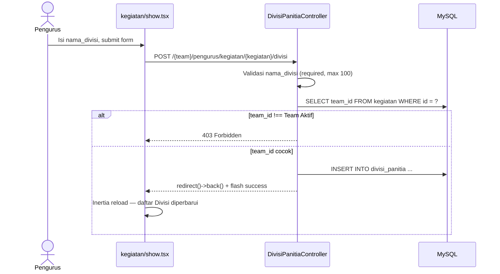
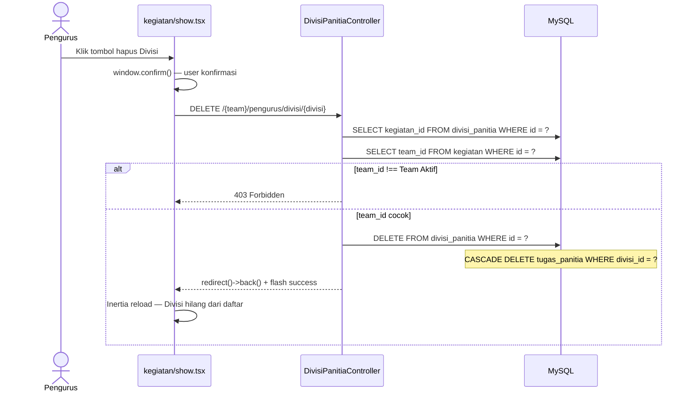

# Design Document: Manajemen Divisi Panitia per Kegiatan (FR-25)

## Overview

Fitur ini menambahkan kemampuan tambah dan hapus Divisi Panitia langsung dari halaman Detail Kegiatan (`kegiatan/show`). Divisi adalah pengelompokan struktural kepanitiaan (mis. "Acara", "Konsumsi") yang menjadi wadah `tugas_panitia` pada FR-26–28.

Infrastruktur database sudah lengkap: tabel `divisi_panitia` (kolom `kegiatan_id`, `nama_divisi`) dan model `DivisiPanitia` sudah ada. Halaman `kegiatan/show` sudah menampilkan daftar Divisi secara read-only. Spec ini hanya menambahkan operasi tulis (store dan destroy) tanpa migrasi baru.

Keputusan desain utama:
- **Controller baru** `DivisiPanitiaController` mengikuti pola `SesiController` — parameter `string $currentTeam` + model binding, redirect back, verifikasi team scope manual.
- **Prop `canManage`** dikirim dari `KegiatanController::detail()` berdasarkan team role user, menggantikan pengecekan role di frontend.
- Cascade delete `tugas_panitia` sudah dikonfigurasi di FK migration, tidak perlu logika PHP.

## Architecture

Tidak ada layer baru. Fitur mengikuti arsitektur Inertia + Laravel yang sudah ada:

```
Browser
  │  POST /team/pengurus/kegiatan/{id}/divisi
  │  DELETE /team/pengurus/divisi/{id}
  ▼
web.php (route group pengurus/ — middleware EnsureUserHasRole:pengurus)
  ▼
DivisiPanitiaController
  ├── store()   → validasi → verifikasi team scope → create → redirect()->back()
  └── destroy() → verifikasi team scope → delete → redirect()->back()
  ▼
Inertia redirect → KegiatanController::detail() (fresh data) → kegiatan/show.tsx
```

Alur store:



Alur destroy:



## Components and Interfaces

### DivisiPanitiaController

File baru: `app/Http/Controllers/DivisiPanitiaController.php`

```php
class DivisiPanitiaController extends Controller
{
    public function store(
        Request $request,
        string $currentTeam,
        Kegiatan $kegiatan
    ): RedirectResponse

    public function destroy(
        Request $request,
        string $currentTeam,
        DivisiPanitia $divisi
    ): RedirectResponse
}
```

**`store()`**:
1. Validasi: `nama_divisi` required, string, max 100.
2. Resolve Team dari slug `$currentTeam` via `Team::where('slug', $currentTeam)->firstOrFail()`.
3. `abort_if($kegiatan->team_id !== $team->id, 403)`.
4. `$kegiatan->divisiPanitia()->create(['nama_divisi' => $validated['nama_divisi']])`.
5. `redirect()->back()->with('success', "Divisi \"{$validated['nama_divisi']}\" berhasil ditambahkan.")`.

**`destroy()`**:
1. Resolve Team dari slug.
2. Load `$divisi->load('kegiatan')` — eager load untuk mendapat `kegiatan.team_id`.
3. `abort_if($divisi->kegiatan->team_id !== $team->id, 403)`.
4. `$divisi->delete()` — cascade FK otomatis hapus `tugas_panitia`.
5. `redirect()->back()->with('success', 'Divisi berhasil dihapus.')`.

### Routes

Tambahkan di `routes/web.php` di dalam grup `pengurus/` yang sudah ada:

```php
Route::post('kegiatan/{kegiatan}/divisi', [DivisiPanitiaController::class, 'store'])
    ->name('divisi.store');
Route::delete('divisi/{divisi}', [DivisiPanitiaController::class, 'destroy'])
    ->name('divisi.destroy');
```

Kedua route inherit middleware `EnsureUserHasRole:pengurus` dari grup induk.

### KegiatanController::detail()

Tambahkan prop `canManage` ke response Inertia:

```php
public function detail(Request $request, string $currentTeam, Kegiatan $kegiatan): Response
{
    return Inertia::render('kegiatan/show', [
        'kegiatan' => $kegiatan->load([...]),
        'canManage' => $request->user()->role === 'pengurus',
    ]);
}
```

### kegiatan/show.tsx

**Perubahan Props:**

```typescript
type Props = {
    kegiatan: Kegiatan;
    canManage: boolean;   // baru
};
```

**Section "Panitia dan Tugas" — jika `canManage === true`:**

- Form inline di atas daftar Divisi menggunakan `useForm`:
  ```typescript
  const form = useForm({ nama_divisi: '' });
  // submit ke route('divisi.store', {current_team, kegiatan: kegiatan.id})
  ```
- Input text `nama_divisi` (maxLength 100) + tombol "Tambah Divisi".
- Tampilkan `form.errors.nama_divisi` di bawah input bila ada.
- Tiap baris Divisi: tambahkan tombol hapus kecil.
  ```typescript
  router.delete(
      route('divisi.destroy', { current_team, divisi: divisi.id }),
      { onBefore: () => window.confirm(`Hapus divisi "${divisi.nama_divisi}"?`) }
  );
  ```

**Jika `canManage === false`:** tampilan read-only tidak berubah dari kondisi saat ini.

## Data Models

### DivisiPanitia (sudah ada, tidak ada perubahan skema)

| Kolom        | Tipe          | Constraint          |
|--------------|---------------|---------------------|
| id           | bigint        | PK, auto-increment  |
| kegiatan_id  | bigint        | FK → kegiatan(id), CASCADE DELETE |
| nama_divisi  | varchar(100)  | NOT NULL            |
| created_at   | timestamp     |                     |
| updated_at   | timestamp     |                     |

### Relasi cascade yang relevan

```
kegiatan (1) ──< divisi_panitia (1) ──< tugas_panitia
              cascadeOnDelete          cascadeOnDelete
```

Menghapus `divisi_panitia` secara otomatis menghapus semua `tugas_panitia` dengan `divisi_id` yang sama — dikonfirmasi dari migration `2026_08_10_081315_create_tugas_panitia_table.php`.

### Perubahan model DivisiPanitia

Tambahkan `HasFactory` trait untuk keperluan test:

```php
use Illuminate\Database\Eloquent\Factories\HasFactory;

class DivisiPanitia extends Model
{
    use HasFactory;
    // ... selebihnya tidak berubah
}
```

## Correctness Properties

*A property is a characteristic or behavior that should hold true across all valid executions of a system — essentially, a formal statement about what the system should do. Properties serve as the bridge between human-readable specifications and machine-verifiable correctness guarantees.*

Fitur ini adalah operasi CRUD dengan validasi otorisasi. PBT tidak tepat karena tidak ada transformasi data yang nilai kebenarannya bervariasi secara bermakna dengan input arbitrary. Correctness properties di bawah dirumuskan sebagai invariant yang diverifikasi melalui example-based tests.

### Property 1: Team Scope Isolation pada Store

*Untuk setiap* request store Divisi, `divisi_panitia` yang berhasil dibuat **selalu** memiliki `kegiatan_id` yang menunjuk ke Kegiatan dengan `team_id` sama dengan Team Aktif user — tidak pernah ada Divisi yang tercipta untuk Kegiatan dari Team lain, bahkan jika `kegiatan_id` di URL dimanipulasi.

**Validates: Requirements 1.2, 1.3**

### Property 2: Team Scope Isolation pada Destroy

*Untuk setiap* request destroy Divisi, penghapusan **hanya** terjadi jika `divisi.kegiatan.team_id` sama dengan Team Aktif user. Request dengan `divisi_id` yang valid secara database namun milik Team lain selalu menghasilkan 403 tanpa modifikasi data apapun.

**Validates: Requirements 3.2, 3.3**

### Property 3: Cascade Delete Konsistensi

*Untuk setiap* Divisi yang dihapus, semua `tugas_panitia` dengan `divisi_id` yang sama **selalu** ikut terhapus — tidak pernah ada orphan `tugas_panitia` yang merujuk ke Divisi yang sudah tidak ada.

**Validates: Requirements 3.5**

## Error Handling

| Kondisi | Penanganan |
|---|---|
| `nama_divisi` kosong / tidak dikirim | Validation error kunci `nama_divisi`, redirect back with errors |
| `nama_divisi` > 100 karakter | Validation error kunci `nama_divisi`, redirect back with errors |
| `kegiatan.team_id` ≠ Team Aktif (store) | `abort(403)` |
| `divisi.kegiatan.team_id` ≠ Team Aktif (destroy) | `abort(403)` |
| Kegiatan tidak ditemukan (route model binding) | Laravel default 404 |
| Divisi tidak ditemukan (route model binding) | Laravel default 404 |
| User bukan pengurus | Middleware `EnsureUserHasRole:pengurus` → 403, tidak sampai ke controller |

Error 403 dari controller dikembalikan sebagai response Inertia error page standar.

Frontend menampilkan `form.errors.nama_divisi` inline di bawah input. Error 403 dari delete muncul sebagai Inertia error page (jarang terjadi di production karena tombol hapus hanya tampil untuk Pengurus).

## Testing Strategy

Fitur ini cocok dengan **example-based Pest feature tests** — tidak ada transformasi data yang non-trivial, sehingga PBT tidak menambah nilai dibanding contoh konkret yang well-chosen.

File test: `tests/Feature/DivisiPanitiaTest.php`

### Setup helpers (mengikuti pola KegiatanStoreWithRundownTest)

```php
function pengurusInTeam(Team $team): User  // sudah ada di file lain, buat ulang lokal
function anggotaInTeam(Team $team): User
function kegiatanForTeam(Team $team): Kegiatan
```

### Test cases

**TC-1 — Store: Pengurus berhasil tambah Divisi ke Kegiatan milik Team-nya**
- Setup: Pengurus, Team A, Kegiatan milik Team A.
- Action: POST ke `divisi.store` dengan `nama_divisi = 'Acara'`.
- Assert: `assertRedirect()`, `assertDatabaseHas('divisi_panitia', ['nama_divisi' => 'Acara', 'kegiatan_id' => $kegiatan->id])`.

**TC-2 — Store: Member tidak bisa tambah Divisi (403 dari middleware)**
- Setup: Member, Team A, Kegiatan milik Team A.
- Action: POST ke `divisi.store`.
- Assert: `assertForbidden()` (middleware berhenti sebelum controller).

**TC-3 — Store: Pengurus tidak bisa tambah Divisi ke Kegiatan Team lain (403 dari controller)**
- Setup: Pengurus di Team A, Kegiatan milik Team B.
- Action: POST ke URL `/{team-a}/pengurus/kegiatan/{kegiatan-team-b}/divisi`.
- Assert: `assertForbidden()`.

**TC-4 — Validasi: `nama_divisi` kosong gagal**
- Setup: Pengurus, Team, Kegiatan milik Team.
- Action: POST dengan `nama_divisi = ''`.
- Assert: `assertSessionHasErrors('nama_divisi')`, tidak ada record baru di DB.

**TC-5 — Validasi: `nama_divisi` > 100 karakter gagal**
- Action: POST dengan `nama_divisi = str_repeat('a', 101)`.
- Assert: `assertSessionHasErrors('nama_divisi')`.

**TC-6 — Destroy: Pengurus berhasil hapus Divisi milik Team-nya**
- Setup: Pengurus, Team A, Kegiatan dan Divisi milik Team A.
- Action: DELETE ke `divisi.destroy`.
- Assert: `assertRedirect()`, `assertDatabaseMissing('divisi_panitia', ['id' => $divisi->id])`.

**TC-7 — Destroy: Pengurus tidak bisa hapus Divisi dari Team lain (403)**
- Setup: Pengurus di Team A, Divisi milik Kegiatan Team B.
- Action: DELETE ke `/{team-a}/pengurus/divisi/{divisi-team-b}`.
- Assert: `assertForbidden()`, record masih ada di DB.

**TC-8 — Destroy: Hapus Divisi cascade-hapus TugasPanitia miliknya**
- Setup: Divisi dengan 2 TugasPanitia.
- Action: DELETE ke `divisi.destroy`.
- Assert: `assertDatabaseMissing('tugas_panitia', ['divisi_id' => $divisi->id])`.

Jalankan test dengan:
```bash
php artisan test --compact --filter=DivisiPanitia
```
