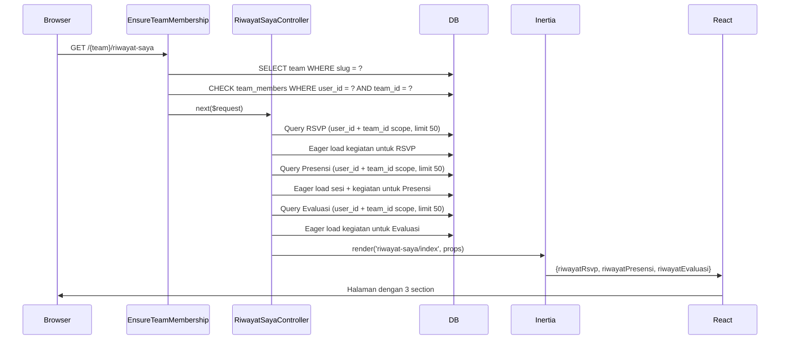

# Design Document: Halaman Riwayat Saya (FR-41)

## Overview

Halaman Riwayat Saya adalah halaman read-only yang merangkum keterlibatan personal seorang User di Team aktifnya. Halaman ini menampilkan tiga section: riwayat RSVP, riwayat presensi per Sesi, dan riwayat evaluasi yang pernah diberikan. Semua data di-scope ketat ke `auth()->id()` dan `user->currentTeam->id` — tidak ada parameter URL yang dapat dimanipulasi untuk melihat data user lain.

Halaman ini dapat diakses oleh semua Team Role (`owner`, `admin`, `member`) dan bersifat murni informatif (tidak ada aksi kelola, tidak ada form).

---

## Architecture

### Alur Request

```
Browser → GET /{current_team}/riwayat-saya
  → web middleware group
  → auth middleware (Fortify)
  → verified middleware
  → EnsureTeamMembership (resolves {current_team} slug → Team, cek keanggotaan)
  → RiwayatSayaController::index()
  → Inertia::render('riwayat-saya/index', props)
  → React page: resources/js/pages/riwayat-saya/index.tsx
```

### Posisi dalam Routing

Route ini bergabung ke dalam grup `/{current_team}` yang sudah ada di `routes/web.php`, tanpa tambahan middleware role (accessible oleh semua role). Ini konsisten dengan pola route "bersama" seperti `kalender.index` dan `kegiatan.show`.

### Catatan Penting: Prasyarat `team_id` di Tabel `kegiatan`

Berdasarkan audit kode, kolom `kegiatan.team_id` **belum ada** di migration saat ini. Kolom ini adalah prasyarat wajib untuk fitur ini karena semua query scope ke Team lewat join ke tabel `kegiatan`. Sebelum implementasi controller, migration berikut harus dibuat terlebih dahulu:

```php
// migration: add_team_id_to_kegiatan_table
$table->foreignId('team_id')
    ->after('id')
    ->constrained('teams')
    ->cascadeOnDelete();
```

Model `Kegiatan` juga harus ditambahkan relasi `belongsTo(Team::class)` dan kolom `team_id` ditambahkan ke `$fillable`.

---

## Components and Interfaces

### Backend

#### Route

```php
// routes/web.php — dalam grup /{current_team} yang ada
Route::get('riwayat-saya', [RiwayatSayaController::class, 'index'])
    ->name('riwayat-saya.index');
```

Route ini diletakkan di dalam grup `/{current_team}` yang sudah menggunakan middleware `['auth', 'verified', EnsureTeamMembership::class]`, sehingga tidak memerlukan middleware tambahan.

#### Controller

```
app/Http/Controllers/RiwayatSayaController.php
```

Single-action controller dengan satu method `index()`. Menerima `Request` dan `string $currentTeam` (slug) sesuai pola controller lain. Mengambil `user->currentTeam` dari relasi (sudah dimuat oleh `EnsureTeamMembership` melalui `switchTeam`), kemudian menjalankan tiga query eager-loaded ke Inertia.

#### Wayfinder Route (auto-generated)

Setelah route didaftarkan, jalankan `php artisan wayfinder:generate` untuk menghasilkan:
```
resources/js/routes/riwayat-saya/index.ts
```

### Frontend

```
resources/js/pages/riwayat-saya/index.tsx
```

Halaman React tunggal yang menerima tiga prop array: `riwayatRsvp`, `riwayatPresensi`, `riwayatEvaluasi`. Menampilkan tiga `<Section>` dengan card list dan empty state masing-masing.

---

## Data Models

### Props yang Dikirim dari Controller ke React

```typescript
// Shape props Inertia untuk halaman riwayat-saya/index

type RiwayatRsvpItem = {
  id: number;
  kegiatanNama: string;
  kegiatanId: number;
  status: 'terdaftar' | 'dibatalkan';
  waktuDaftar: string; // ISO 8601
};

type RiwayatPresensiItem = {
  id: number;
  kegiatanNama: string;
  sesiNama: string; // "Sesi {urutan}" — dibangun di controller
  sesiTanggal: string | null; // 'YYYY-MM-DD' atau null
  waktuIsi: string | null; // ISO 8601 atau null
};

type RiwayatEvaluasiItem = {
  id: number;
  kegiatanNama: string;
  kegiatanId: number;
  rating: number; // 1–5
  komentar: string | null;
  tanggal: string; // ISO 8601 (evaluasi.created_at)
};

type Props = {
  riwayatRsvp: RiwayatRsvpItem[];
  riwayatPresensi: RiwayatPresensiItem[];
  riwayatEvaluasi: RiwayatEvaluasiItem[];
};
```

### Query Design — Tiga Queries Utama

Semua query **tidak mengambil kolom sensitif** dan hanya scope ke `user_id = auth()->id()` + `kegiatan.team_id = currentTeam->id`.

#### Query 1: Riwayat RSVP

```php
$teamId = $user->currentTeam->id;

$riwayatRsvp = Rsvp::with([
        'kegiatan:id,nama',
    ])
    ->where('user_id', $user->id)
    ->whereHas('kegiatan', fn ($q) => $q->where('team_id', $teamId)->withoutTrashed())
    ->orderByDesc('waktu_daftar')
    ->limit(50)
    ->get()
    ->map(fn (Rsvp $r) => [
        'id'           => $r->id,
        'kegiatanNama' => $r->kegiatan->nama,
        'kegiatanId'   => $r->kegiatan->id,
        'status'       => $r->status,
        'waktuDaftar'  => $r->waktu_daftar?->toIso8601String(),
    ]);
```

**Catatan:** `whereHas` + `with` menyebabkan dua query total (1 `WHERE EXISTS` subquery, 1 eager load `kegiatan`) — bukan N+1. Karena `with` hanya memuat relasi untuk record yang sudah difilter, jumlah query konstan terhadap jumlah record.

#### Query 2: Riwayat Presensi

```php
$riwayatPresensi = Presensi::with([
        'sesi:id,kegiatan_id,tanggal',
        'sesi.kegiatan:id,nama',
    ])
    ->where('user_id', $user->id)
    ->whereHas('sesi.kegiatan', fn ($q) => $q->where('team_id', $teamId)->withoutTrashed())
    ->orderByDesc('waktu_isi')
    ->limit(50)
    ->get()
    ->map(fn (Presensi $p) => [
        'id'          => $p->id,
        'kegiatanNama'=> $p->sesi->kegiatan->nama,
        'sesiTanggal' => $p->sesi->tanggal?->format('Y-m-d'),
        'waktuIsi'    => $p->waktu_isi?->toIso8601String(),
    ]);
```

**Catatan:** `Presensi` tidak memiliki `timestamps` (tanpa `created_at`/`updated_at`). Kolom urutan sesi tidak ada sebagai kolom DB, sehingga label "Sesi X" tidak dibuat — diganti dengan menampilkan `sesiTanggal` sebagai identifikasi.

#### Query 3: Riwayat Evaluasi

```php
$riwayatEvaluasi = Evaluasi::with([
        'kegiatan:id,nama',
    ])
    ->where('user_id', $user->id)
    ->whereHas('kegiatan', fn ($q) => $q->where('team_id', $teamId)->withoutTrashed())
    ->orderByDesc('created_at')
    ->limit(50)
    ->get()
    ->map(fn (Evaluasi $e) => [
        'id'          => $e->id,
        'kegiatanNama'=> $e->kegiatan->nama,
        'kegiatanId'  => $e->kegiatan->id,
        'rating'      => $e->rating,
        'komentar'    => $e->komentar,
        'tanggal'     => $e->created_at?->toIso8601String(),
    ]);
```

**Catatan:** `whereHas` dengan `withoutTrashed()` secara implisit memastikan Evaluasi untuk Kegiatan yang sudah soft-deleted tidak muncul (Req 5.5).

### Relasi yang Digunakan

| Relasi | Tipe | Digunakan Untuk |
|--------|------|----------------|
| `User::rsvp()` | `hasMany(Rsvp::class)` | Query RSVP user |
| `User::presensi()` | `hasMany(Presensi::class)` | Query presensi user |
| `User::evaluasi()` | `hasMany(Evaluasi::class)` | Query evaluasi user |
| `Rsvp::kegiatan()` | `belongsTo(Kegiatan::class)` | Eager load nama kegiatan |
| `Presensi::sesi()` | `belongsTo(Sesi::class)` | Eager load sesi + tanggal |
| `Sesi::kegiatan()` | `belongsTo(Kegiatan::class)` | Eager load nama kegiatan |
| `Evaluasi::kegiatan()` | `belongsTo(Kegiatan::class)` | Eager load nama kegiatan |

Semua relasi ini sudah ada di model masing-masing — tidak ada relasi baru yang perlu dibuat.

---

## Correctness Properties

*A property is a characteristic or behavior that should hold true across all valid executions of a system — essentially, a formal statement about what the system should do. Properties serve as the bridge between human-readable specifications and machine-verifiable correctness guarantees.*

Fitur ini adalah **read-only data retrieval** dari database dengan query sederhana — tidak ada transformasi data yang bersifat komputasional, tidak ada serializer/parser, dan tidak ada pure function yang memiliki input space besar. Testing properti universal dengan ratusan iterasi tidak memberikan nilai tambah dibanding example-based tests yang sudah mencakup kasus-kasus penting. PBT tidak diterapkan untuk fitur ini; properti di bawah diverifikasi via example-based feature tests.

### Property 1: Isolasi Data User

*For any* user yang mengakses halaman riwayat-saya, semua item dalam `riwayatRsvp`, `riwayatPresensi`, dan `riwayatEvaluasi` yang dikembalikan harus dimiliki oleh user tersebut — tidak ada data milik user lain dalam Team yang sama yang boleh muncul.

**Validates: Requirements 3.1, 3.2**

### Property 2: Scope Team

*For any* user yang terdaftar di lebih dari satu Team, data yang ditampilkan di halaman riwayat-saya hanya boleh berasal dari Team yang sedang aktif (`currentTeam`) — tidak ada data dari Team lain yang bocor ke response.

**Validates: Requirements 3.3**

### Property 3: Kegiatan Soft-Deleted Tidak Muncul

*For any* Kegiatan yang telah di-soft-delete, semua riwayat (RSVP, Presensi, Evaluasi) yang terkait dengan Kegiatan tersebut tidak boleh muncul dalam response — invariant ini berlaku untuk kegiatan manapun dan user manapun.

**Validates: Requirements 5.5**

---

## Error Handling

### Kasus 1: `currentTeam` null saat controller dieksekusi

`EnsureTeamMembership` middleware menangani ini sebelum controller dipanggil — jika user tidak punya team atau slug tidak valid, middleware sudah `abort(403)`. Controller bisa mengasumsikan `$user->currentTeam` tidak null.

Namun sebagai defensive programming, controller tetap menggunakan:
```php
$team = $request->user()->currentTeam;
abort_if(! $team, 403, 'User tidak terdaftar di Team mana pun.');
```

### Kasus 2: Salah satu query gagal

Karena ketiga query dijalankan secara berurutan dalam satu request, jika ada query yang gagal (misal exception DB), Laravel akan melempar exception dan Inertia akan menampilkan halaman error 500 standar. Tidak ada partial failure handling — ketiga section dimuat dalam satu request.

### Kasus 3: Data kosong

Setiap query yang mengembalikan collection kosong akan dikirim sebagai array kosong `[]` ke React. React menampilkan empty state per section. Tidak ada response error — ini kasus normal yang valid.

### Kasus 4: `sesi.tanggal` atau `presensi.waktu_isi` null

Kolom `sesi.tanggal` di-cast sebagai `date` (di model Sesi) sehingga bisa null jika data korup. `presensi.waktu_isi` adalah timestamp dengan `useCurrent()` sehingga seharusnya tidak null, tetapi model menggunakan `?->toIso8601String()` (null-safe) untuk keduanya. React menampilkan `"-"` untuk nilai null (Req 4.5).

---

## Testing Strategy

Fitur ini terdiri dari CRUD read-only (query + Inertia render). PBT tidak sesuai karena:
- Tidak ada pure function dengan input space besar yang menghasilkan output bervariasi
- Tidak ada serializer/parser atau transformasi komputasional
- Behavior query database tidak bervariasi secara meaningful dengan jumlah record (limit sudah diterapkan)

Testing strategy yang digunakan adalah **example-based feature tests** dengan Pest, mengikuti pola `DashboardTest.php`.

### Test Cases

#### 1. Access Control

```php
// Guest diarahkan ke login
test('guest diarahkan ke login saat mengakses riwayat-saya')

// Semua team role bisa akses
test('anggota bisa mengakses halaman riwayat-saya')
test('pengurus bisa mengakses halaman riwayat-saya')

// User yang tidak terdaftar di team tidak bisa akses
test('user yang bukan anggota team mendapat 403')
```

#### 2. Data Scoping (paling kritis)

```php
// Tidak menampilkan data user lain
test('riwayat_rsvp hanya berisi data user yang login, bukan user lain dalam team yang sama')

// Tidak menampilkan data dari team lain
test('riwayat_presensi tidak memuat data dari team lain yang juga diikuti user')

// Tidak menampilkan evaluasi untuk kegiatan yang sudah dihapus
test('evaluasi untuk kegiatan yang soft-deleted tidak muncul di riwayat')
```

#### 3. Ordering dan Limit

```php
// Ordering descending
test('riwayat_rsvp diurutkan waktu_daftar descending')
test('riwayat_presensi diurutkan waktu_isi descending')

// Limit 50
test('controller membatasi riwayat_presensi maksimal 50 record')
```

#### 4. Empty State

```php
// User baru tanpa riwayat apapun
test('halaman riwayat-saya dapat diakses dan merender tiga section kosong untuk user tanpa riwayat')
```

#### 5. Inertia Props Shape

```php
// Memastikan semua props ada dan bertipe benar
test('halaman riwayat-saya merender komponen yang benar dengan props yang sesuai')
// Menggunakan AssertableInertia::has() dan where() untuk memverifikasi shape
```

### Contoh Test Pattern

Mengikuti pola yang ada di `tests/Feature/DashboardTest.php`:

```php
use App\Enums\TeamRole;
use App\Models\Rsvp;
use App\Models\Team;
use App\Models\User;
use Inertia\Testing\AssertableInertia as Assert;

test('riwayat_rsvp hanya berisi data milik user aktif', function () {
    $team = Team::factory()->create();
    $user = User::factory()->create(['current_team_id' => $team->id]);
    $otherUser = User::factory()->create(['current_team_id' => $team->id]);

    $team->members()->attach($user, ['role' => TeamRole::Member->value]);
    $team->members()->attach($otherUser, ['role' => TeamRole::Member->value]);

    // Kegiatan milik team yang sama
    $kegiatan = Kegiatan::factory()->create(['team_id' => $team->id]);

    // RSVP milik $user
    Rsvp::factory()->create(['user_id' => $user->id, 'kegiatan_id' => $kegiatan->id]);
    // RSVP milik user lain di team yang sama — TIDAK boleh muncul
    Rsvp::factory()->create(['user_id' => $otherUser->id, 'kegiatan_id' => $kegiatan->id]);

    $this->actingAs($user)
        ->get(route('riwayat-saya.index', ['current_team' => $team->slug]))
        ->assertInertia(fn (Assert $page) => $page
            ->component('riwayat-saya/index')
            ->has('riwayatRsvp', 1)
            ->where('riwayatRsvp.0.kegiatanNama', $kegiatan->nama)
        );
});
```

### Performance Verification

Setiap test yang mengakses endpoint riwayat-saya sebaiknya dijalankan dengan `DB::enableQueryLog()` untuk memverifikasi jumlah query konstan (Req 8.1). Ini tidak perlu menjadi test tersendiri — cukup diverifikasi sekali di satu test sebagai assertion tambahan.

---

## React Page Design

### Struktur Komponen

```
resources/js/pages/riwayat-saya/index.tsx
  └── <Head title="Riwayat Saya" />
  └── <div> (container utama)
        ├── <PageHeader>  ("Riwayat Saya")
        ├── <SectionRsvp>
        │     ├── Badge status ("terdaftar" → hijau, "dibatalkan" → merah/netral)
        │     └── <EmptyState> jika array kosong
        ├── <SectionPresensi>
        │     └── <EmptyState> jika array kosong
        └── <SectionEvaluasi>
              ├── Star rating display
              ├── Komentar truncated 200 karakter
              └── <EmptyState> jika array kosong
```

### Layout dan Breadcrumb

Mengikuti pola `dashboard.tsx` — halaman mendefinisikan `Page.layout` sebagai object breadcrumb:

```typescript
RiwayatSaya.layout = (props: { currentTeam?: { slug: string } | null }) => ({
    breadcrumbs: [
        {
            title: 'Riwayat Saya',
            href: props.currentTeam
                ? `/${props.currentTeam.slug}/riwayat-saya`
                : '/riwayat-saya',
        },
    ],
});
```

`AppLayoutTemplate` (via `app-sidebar-layout`) akan mengambil breadcrumbs ini secara otomatis — sesuai pola `app-layout.tsx` yang sudah ada.

### Badge Status RSVP

```typescript
function RsvpStatusBadge({ status }: { status: 'terdaftar' | 'dibatalkan' }) {
    const styles = {
        terdaftar: 'bg-green-100 text-green-700 dark:bg-green-900/40 dark:text-green-300',
        dibatalkan: 'bg-neutral-100 text-neutral-500 dark:bg-neutral-800 dark:text-neutral-400',
    };
    return (
        <span className={`inline-flex items-center rounded-full px-2 py-0.5 text-xs font-medium ${styles[status]}`}>
            {status}
        </span>
    );
}
```

### Section Wrapper

Mengikuti pola `Section` component yang sudah ada di `kegiatan/show.tsx`:

```typescript
function Section({ title, icon, children }: SectionProps) {
    return (
        <section className="rounded-xl border border-sidebar-border/70 bg-white p-5 shadow-sm dark:border-sidebar-border dark:bg-neutral-900">
            <div className="mb-4 flex items-center gap-2">
                <span className="text-indigo-600 dark:text-indigo-400">{icon}</span>
                <h2 className="font-semibold text-neutral-900 dark:text-neutral-100">{title}</h2>
            </div>
            {children}
        </section>
    );
}
```

### Empty State

```typescript
function EmptyState({ message }: { message: string }) {
    return (
        <p className="py-6 text-center text-sm text-neutral-400">
            {message}
        </p>
    );
}
```

### Truncate Komentar

Komentar evaluasi dipotong di 200 karakter di sisi React (bukan controller) karena data tetap perlu dikirim utuh jika suatu saat ingin ada ekspansi. Namun agar payload tidak boros, controller membatasi dengan `limit(50)`.

```typescript
function truncate(text: string, max = 200): string {
    return text.length > max ? text.slice(0, max) + '…' : text;
}
```

### Formatters

```typescript
function formatTanggal(iso: string): string {
    return new Date(iso).toLocaleDateString('id-ID', {
        day: 'numeric',
        month: 'long',
        year: 'numeric',
    });
}

function formatWaktu(iso: string): string {
    return new Date(iso).toLocaleTimeString('id-ID', {
        hour: '2-digit',
        minute: '2-digit',
    });
}
```

---

## Diagram Alur Data



---

## Catatan Implementasi

1. **Urutan implementasi**: Migration `add_team_id_to_kegiatan_table` → Update model `Kegiatan` → Route → Controller → React page → Tests.

2. **Wayfinder**: Setelah route didaftarkan, jalankan `php artisan wayfinder:generate` untuk menghasilkan TypeScript route helper. Gunakan helper ini di React untuk membuat link ke halaman riwayat dari dashboard atau sidebar.

3. **Sidebar/navigasi**: Link ke `/riwayat-saya` dari Anggota Dashboard sudah ada di `dashboard.tsx` (line yang berisi `href="/riwayat-saya"`). Setelah route terdaftar, link ini perlu diperbarui menggunakan route helper wayfinder yang baru.

4. **No `team_id` scope di controller saat ini**: Controller lain seperti `KegiatanController` dan `CalendarController` belum melakukan team scoping (bug yang diketahui). Controller `RiwayatSayaController` **harus** melakukan team scoping via `whereHas(..., fn ($q) => $q->where('team_id', $teamId))` — jangan ikuti pola lama yang tidak di-scope.
