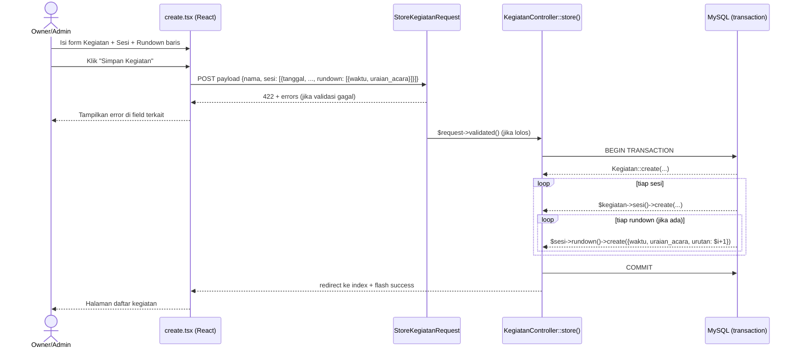

# Design Document — Tambah Input Rundown ke Form Create Kegiatan (FR-10)

## Overview

Fitur ini memperluas form Create Kegiatan (`create.tsx`) agar pengguna (Owner/Admin Team) dapat mengisi rundown tiap Sesi langsung di satu form yang sama. Saat ini rundown hanya bisa diisi setelah Kegiatan dan Sesi tersimpan via `RundownController::upsert` yang terpisah. Dengan perubahan ini, seluruh data — Kegiatan, Sesi, dan Rundown — dikirim dalam satu POST dan disimpan dalam satu database transaction.

Scope perubahan terbatas pada tiga file:

| File | Perubahan |
|---|---|
| `StoreKegiatanRequest` | Tambah rules validasi untuk `sesi.*.rundown.*` |
| `KegiatanController::store()` | Wrap dalam `DB::transaction`, loop rundown per sesi |
| `create.tsx` | Tambah type `RundownForm`, state rundown per sesi, UI sub-bagian rundown |

Tidak ada migration baru, route baru, atau perubahan pada `RundownController::upsert`.

---

## Architecture

Alur request tetap sama — satu POST ke `/{team_slug}/pengurus/kegiatan`. Payload diperluas dengan array `rundown` bersarang di tiap elemen `sesi`.



Bila terjadi exception di mana saja dalam loop, `DB::transaction` otomatis melakukan rollback — tidak ada Kegiatan, Sesi, atau Rundown yang tersimpan sebagian.

---

## Components and Interfaces

### Backend

#### `StoreKegiatanRequest::rules()`

Rules yang ditambahkan:

```php
'sesi.*.rundown'              => 'nullable|array',
'sesi.*.rundown.*.waktu'      => 'required_with:sesi.*.rundown.*|date_format:H:i',
'sesi.*.rundown.*.uraian_acara' => 'required_with:sesi.*.rundown.*|string|max:255',
// 'urutan' sengaja TIDAK ada di rules — diderivasi dari posisi array di controller
```

Kunci desain:
- `sesi.*.rundown` nullable → rundown opsional per sesi (Req 3.2).
- `required_with:sesi.*.rundown.*` memastikan jika array rundown ada dan berisi elemen, setiap elemen harus punya `waktu` dan `uraian_acara` valid.
- Field `urutan` yang dikirim frontend (jika ada) diabaikan sepenuhnya — tidak divalidasi, tidak dipakai (Req 3.5).

#### `KegiatanController::store()`

```php
public function store(StoreKegiatanRequest $request, string $currentTeam): RedirectResponse
{
    $validated = $request->validated();
    $team = Team::where('slug', $currentTeam)->firstOrFail();

    DB::transaction(function () use ($validated, $team) {
        $kegiatan = Kegiatan::create([
            'team_id' => $team->id,
            'nama'    => $validated['nama'],
            'deskripsi' => $validated['deskripsi'] ?? null,
            'tipe'    => $validated['tipe'],
            'kuota'   => $validated['tipe'] === 'terbuka' ? $validated['kuota'] : null,
            'warna'   => self::PALET_WARNA[Kegiatan::count() % count(self::PALET_WARNA)],
        ]);

        foreach ($validated['sesi'] as $sesiData) {
            $sesi = $kegiatan->sesi()->create([
                'tanggal'       => $sesiData['tanggal'],
                'waktu_mulai'   => $sesiData['waktu_mulai'],
                'waktu_selesai' => $sesiData['waktu_selesai'],
                'lokasi'        => $sesiData['lokasi'],
            ]);

            foreach ($sesiData['rundown'] ?? [] as $i => $rundownItem) {
                $sesi->rundown()->create([
                    'waktu'        => $rundownItem['waktu'],
                    'uraian_acara' => $rundownItem['uraian_acara'],
                    'urutan'       => $i + 1,   // posisi array → 1-based
                ]);
            }
        }
    });

    return redirect()
        ->route('pengurus.kegiatan.index', ['current_team' => $currentTeam])
        ->with('success', 'Kegiatan berhasil dibuat.');
}
```

`DB::transaction` menerima closure — jika exception apapun dilempar di dalamnya, Laravel otomatis rollback (Req 4.1, 4.2).

Perhatikan bahwa `$sesiData` hanya dilewatkan field Sesi yang valid ke `sesi()->create()` — field `rundown` tidak masuk ke sini karena tidak ada di `$fillable` model Sesi, tapi lebih aman dieksplisit agar tidak bergantung pada mass-assignment protection.

### Frontend

#### Type Definitions (`create.tsx`)

```typescript
type RundownForm = {
    waktu: string;        // format HH:mm dari <input type="time">
    uraian_acara: string;
};

type SesiForm = {
    tanggal: string;
    waktu_mulai: string;
    waktu_selesai: string;
    lokasi: string;
    rundown: RundownForm[];   // ditambahkan — default []
};
```

#### State Helpers

```typescript
const EMPTY_RUNDOWN: RundownForm = { waktu: '', uraian_acara: '' };

// Tambah baris baru di sesi ke-sesiIdx
function addRundown(sesiIdx: number) {
    const updated = data.sesi.map((s, i) =>
        i === sesiIdx ? { ...s, rundown: [...s.rundown, { ...EMPTY_RUNDOWN }] } : s
    );
    setData('sesi', updated);
}

// Hapus baris rundownIdx dari sesi ke-sesiIdx
// urutan tidak disimpan di state — selalu diderivasi dari index+1 saat render & submit
function removeRundown(sesiIdx: number, rundownIdx: number) {
    const updated = data.sesi.map((s, i) =>
        i === sesiIdx
            ? { ...s, rundown: s.rundown.filter((_, j) => j !== rundownIdx) }
            : s
    );
    setData('sesi', updated);
}

// Update satu field di baris rundown
function updateRundown(
    sesiIdx: number,
    rundownIdx: number,
    field: keyof RundownForm,
    value: string
) {
    const updated = data.sesi.map((s, i) =>
        i === sesiIdx
            ? {
                  ...s,
                  rundown: s.rundown.map((r, j) =>
                      j === rundownIdx ? { ...r, [field]: value } : r
                  ),
              }
            : s
    );
    setData('sesi', updated);
}
```

#### UI Sub-bagian Rundown

Sub-bagian ini dirender di dalam tiap Blok Sesi, di bawah field Lokasi:

```tsx
{/* Sub-bagian Rundown — di bawah input Lokasi */}
<div className="sm:col-span-2 mt-2">
    <div className="flex items-center justify-between mb-2">
        <span className="text-xs font-medium text-neutral-600 dark:text-neutral-400">
            Rundown
        </span>
        <button
            type="button"
            onClick={() => addRundown(idx)}
            className="inline-flex items-center gap-1 rounded-lg border border-indigo-300 px-2 py-0.5 text-xs font-medium text-indigo-600 hover:bg-indigo-50 dark:border-indigo-700 dark:text-indigo-400 dark:hover:bg-indigo-900/30"
        >
            <Plus className="size-3" /> Tambah Baris
        </button>
    </div>

    {sesi.rundown.length === 0 ? (
        <p className="text-xs text-neutral-400 italic">Belum ada baris rundown.</p>
    ) : (
        <div className="flex flex-col gap-2">
            {sesi.rundown.map((row, rIdx) => (
                <div key={rIdx} className="flex items-center gap-2">
                    <span className="w-5 shrink-0 text-center text-xs font-medium text-neutral-400">
                        {rIdx + 1}
                    </span>
                    <input
                        type="time"
                        value={row.waktu}
                        onChange={e => updateRundown(idx, rIdx, 'waktu', e.target.value)}
                        className="w-28 shrink-0 rounded-lg border border-neutral-300 bg-white px-2 py-1.5 text-sm focus:border-indigo-500 focus:outline-none focus:ring-1 focus:ring-indigo-500 dark:border-neutral-700 dark:bg-neutral-800 dark:text-neutral-100"
                    />
                    <div className="flex-1 flex flex-col">
                        <input
                            type="text"
                            value={row.uraian_acara}
                            onChange={e => updateRundown(idx, rIdx, 'uraian_acara', e.target.value)}
                            placeholder="Uraian acara"
                            className="w-full rounded-lg border border-neutral-300 bg-white px-2 py-1.5 text-sm focus:border-indigo-500 focus:outline-none focus:ring-1 focus:ring-indigo-500 dark:border-neutral-700 dark:bg-neutral-800 dark:text-neutral-100"
                        />
                        <InputError message={(errors as Record<string, string>)[`sesi.${idx}.rundown.${rIdx}.waktu`]} />
                        <InputError message={(errors as Record<string, string>)[`sesi.${idx}.rundown.${rIdx}.uraian_acara`]} />
                    </div>
                    <button
                        type="button"
                        onClick={() => removeRundown(idx, rIdx)}
                        className="shrink-0 text-red-400 hover:text-red-600"
                        aria-label="Hapus baris rundown"
                    >
                        <Trash2 className="size-3.5" />
                    </button>
                </div>
            ))}
        </div>
    )}
</div>
```

Field `waktu` menggunakan `<input type="time">` sehingga nilai yang dikirim selalu dalam format `HH:mm` — konsisten dengan rule `date_format:H:i` di backend.

Error path yang dipakai Inertia: `sesi.{N}.rundown.{M}.waktu` dan `sesi.{N}.rundown.{M}.uraian_acara` — ditampilkan di bawah field yang bersesuaian (Req 5.1, 5.2). Karena Inertia mempertahankan form state otomatis lewat `useForm`, data yang sudah diisi pengguna tidak hilang setelah error (Req 5.3).

---

## Data Models

Tidak ada perubahan schema. Tabel dan model yang terlibat:

### `rundowns` (sudah ada)

| Kolom | Tipe | Keterangan |
|---|---|---|
| `id` | bigint PK | |
| `sesi_id` | bigint FK | Relasi ke tabel `sesi` |
| `waktu` | time | Format `HH:mm:ss`, hanya 5 karakter pertama yang ditampilkan di UI |
| `uraian_acara` | varchar(255) | |
| `urutan` | tinyint / int | 1-based, consecutive, ditulis controller dari posisi array |
| `created_at`, `updated_at` | timestamps | |

### Relasi yang dipakai

```
Kegiatan (1) ──hasMany──> Sesi (1) ──hasMany──> Rundown
```

- `Sesi::rundown()` sudah `->orderBy('urutan')` — tampilan di `show.tsx` otomatis terurut.
- `Rundown` model sudah punya `$fillable = ['sesi_id', 'waktu', 'uraian_acara', 'urutan']` — tidak perlu perubahan.

### Payload Shape (POST body)

```json
{
  "nama": "Rapat Pleno",
  "deskripsi": "...",
  "tipe": "wajib_hadir",
  "kuota": null,
  "warna": "#5B4FE9",
  "sesi": [
    {
      "tanggal": "2025-08-01",
      "waktu_mulai": "08:00",
      "waktu_selesai": "10:00",
      "lokasi": "Aula Utama",
      "rundown": [
        { "waktu": "08:00", "uraian_acara": "Pembukaan" },
        { "waktu": "08:15", "uraian_acara": "Sambutan Ketua" }
      ]
    },
    {
      "tanggal": "2025-08-02",
      "waktu_mulai": "13:00",
      "waktu_selesai": "15:00",
      "lokasi": "Ruang Rapat",
      "rundown": []
    }
  ]
}
```

Field `urutan` tidak dikirim dari frontend — controller yang menetapkannya dari posisi elemen.

---

## Correctness Properties

*A property is a characteristic or behavior that should hold true across all valid executions of a system — essentially, a formal statement about what the system should do. Properties serve as the bridge between human-readable specifications and machine-verifiable correctness guarantees.*

### Property 1: Urutan Rundown Selalu Consecutive 1-Based dari Posisi Array

*For any* valid payload yang berisi satu atau lebih Sesi dengan satu atau lebih Baris_Rundown, nilai kolom `urutan` yang tersimpan di database untuk setiap Rundown SHALL sama persis dengan posisi elemen tersebut dalam array `sesi.*.rundown` (elemen pertama → `urutan = 1`, elemen ke-N → `urutan = N`), tanpa gap dan tanpa bergantung pada nilai apapun yang dikirim dari frontend.

**Validates: Requirements 3.5, 4.3**

### Property 2: Atomicity — Tidak Ada Data Tersimpan Sebagian

*For any* request yang menyebabkan kegagalan saat menyimpan salah satu Rundown (mis. constraint violation, exception), tidak ada record Kegiatan, Sesi, maupun Rundown yang tersimpan di database — baik yang berhasil diproses sebelum titik kegagalan maupun yang belum diproses.

**Validates: Requirements 4.1, 4.2**

---

## Error Handling

| Skenario | Penanganan |
|---|---|
| `waktu` format salah (bukan `H:i`) | Laravel mengembalikan 422 dengan key `sesi.{N}.rundown.{M}.waktu`; `InputError` menampilkannya di bawah field waktu baris yang bersangkutan |
| `uraian_acara` kosong atau > 255 karakter | 422 dengan key `sesi.{N}.rundown.{M}.uraian_acara`; ditampilkan di bawah field uraian |
| Exception saat INSERT Rundown | `DB::transaction` rollback seluruh transaction; pengguna mendapat respons error 500 |
| Sesi tanpa rundown (array kosong / key tidak ada) | `?? []` di loop controller — tidak ada INSERT, tidak ada error |
| Pengguna hapus semua baris satu sesi | Sub-bagian Rundown kosong, state `rundown: []`, request valid karena rundown opsional |

---

## Testing Strategy

Fitur ini tidak melibatkan logika transformasi yang memerlukan property-based testing (PBT). Perubahan adalah CRUD dengan validasi dan transaction — cocok untuk example-based Pest feature tests.

### Test Cases (Pest Feature Tests)

**File:** `tests/Feature/KegiatanStoreWithRundownTest.php`

1. **Happy path — sesi + rundown tersimpan atomik dan urutan benar**  
   Submit payload dengan 1 sesi + 2 baris rundown. Assert: record Kegiatan, Sesi, dan 2 Rundown tersimpan; `urutan` baris pertama = 1, baris kedua = 2, tidak bergantung pada urutan yang mungkin ada di payload.

2. **Rundown opsional — kegiatan tanpa rundown berhasil**  
   Submit payload dengan 1 sesi, `rundown` tidak disertakan (atau `[]`). Assert: Kegiatan dan Sesi tersimpan, tidak ada record di tabel `rundowns` untuk sesi tersebut.

3. **Validasi error — `waktu` format salah**  
   Submit `sesi.0.rundown.0.waktu = "8:00am"`. Assert: response 422, error key `sesi.0.rundown.0.waktu` ada di response.

4. **Validasi error — `uraian_acara` kosong**  
   Submit `sesi.0.rundown.0.uraian_acara = ""`. Assert: response 422, error key `sesi.0.rundown.0.uraian_acara` ada.

5. **Validasi error — `uraian_acara` melebihi 255 karakter**  
   Submit `uraian_acara` sepanjang 256 karakter. Assert: response 422 dengan key yang sesuai.

6. **Multi-sesi — rundown hanya di sesi tertentu**  
   Submit 2 sesi: sesi pertama punya 3 baris rundown, sesi kedua tanpa rundown. Assert: 3 Rundown tersimpan untuk sesi pertama (urutan 1, 2, 3), nol Rundown untuk sesi kedua.

7. **Urutan recompute setelah "hapus" di tengah (shape test)**  
   Simulasi: kirim payload di mana frontend sudah menghapus baris tengah, sehingga array rundown terkirim adalah `[baris_A, baris_C]` (bukan `[baris_A, baris_B, baris_C]`). Assert: `urutan` yang tersimpan adalah 1 dan 2 (bukan 1 dan 3).

### Catatan Unit Test Frontend

Logika `removeRundown` (filter array + rerender nomor urut dari index) dapat dicakup dengan unit test React sederhana menggunakan `@testing-library/react` jika dikehendaki, namun prioritas utama ada di Pest feature tests di atas yang memverifikasi end-to-end bahwa tidak ada gap urutan di database.
