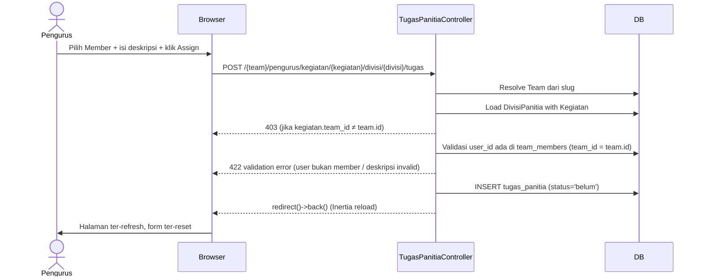
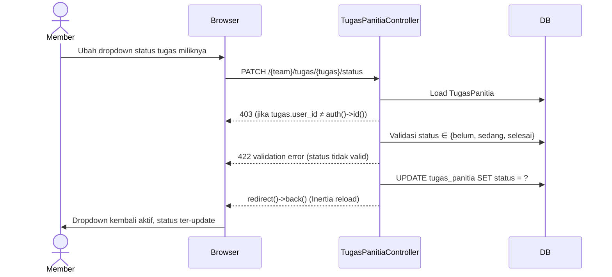

# Design Document — Tugas Panitia (FR-26, FR-27, FR-28)

## Overview

Fitur ini menambahkan tiga kemampuan mutasi di atas infrastruktur data yang
sudah ada (`tugas_panitia`, model `TugasPanitia`, relasi `DivisiPanitia`
→ `tugasPanitia`):

1. **Store** (FR-26): Pengurus meng-assign Member Team ke Divisi Panitia dengan deskripsi tugas.
2. **Destroy** (FR-27): Pengurus menghapus assignment tugas.
3. **UpdateStatus** (FR-28): Member pemilik tugas mengubah status tugasnya sendiri.

Semua operasi di-scope ketat ke Team aktif lewat verifikasi rantai
`tugas_panitia → divisi_panitia → kegiatan → team_id`. UI-nya hidup
sepenuhnya di halaman `kegiatan/show` yang sudah ada — tidak ada halaman baru
yang perlu dibuat.

---

## Architecture

### Alur Request: Store Tugas



### Alur Request: Update Status Tugas



---

## Components and Interfaces

### Backend

#### `TugasPanitiaController` (file baru)

```
app/Http/Controllers/TugasPanitiaController.php
```

Tiga method public:

| Method | Signature | Middleware |
|---|---|---|
| `store` | `(Request, string $currentTeam, Kegiatan $kegiatan, DivisiPanitia $divisi): RedirectResponse` | `pengurus` |
| `destroy` | `(Request, string $currentTeam, TugasPanitia $tugas): RedirectResponse` | `pengurus` |
| `updateStatus` | `(Request, string $currentTeam, TugasPanitia $tugas): RedirectResponse` | `auth, verified, EnsureTeamMembership` (semua role) |

**`store`** — logika verifikasi:

```php
$team = Team::where('slug', $currentTeam)->firstOrFail();
$divisi->load('kegiatan');
abort_if($divisi->kegiatan->team_id !== $team->id, 403);
// pastikan $kegiatan->id === $divisi->kegiatan_id juga (route binding double-check)
abort_if($divisi->kegiatan_id !== $kegiatan->id, 403);

$validated = $request->validate([
    'user_id'        => ['required', 'integer', Rule::exists('team_members', 'user_id')
                            ->where('team_id', $team->id)],
    'deskripsi_tugas'=> ['required', 'string', 'max:255'],
]);

TugasPanitia::create([
    'divisi_id'       => $divisi->id,
    'user_id'         => $validated['user_id'],
    'deskripsi_tugas' => $validated['deskripsi_tugas'],
    'status'          => 'belum',
]);
```

**`destroy`** — logika verifikasi (pola identik dengan `DivisiPanitiaController::destroy`):

```php
$team = Team::where('slug', $currentTeam)->firstOrFail();
$tugas->load('divisiPanitia.kegiatan');
abort_if($tugas->divisiPanitia->kegiatan->team_id !== $team->id, 403);
$tugas->delete();
```

**`updateStatus`** — logika verifikasi (ownership check):

```php
abort_if($tugas->user_id !== $request->user()->id, 403);

$validated = $request->validate([
    'status' => ['required', Rule::in(['belum', 'sedang', 'selesai'])],
]);

$tugas->update(['status' => $validated['status']]);
```

> Hanya kolom `status` yang diperbarui — field lain dari payload diabaikan
> karena `update()` dipanggil dengan array eksplisit, bukan `$request->all()`.

#### `KegiatanController::detail()` — tambahan props

```php
$team = Team::where('slug', $currentTeam)->firstOrFail();
abort_if($kegiatan->team_id !== $team->id, 403);  // sudah ada atau perlu ditambah

return Inertia::render('kegiatan/show', [
    // ... props existing ...
    'anggotaTeam' => $team->members()
        ->get()
        ->map(fn ($u) => ['id' => $u->id, 'name' => $u->name]),
    'authUserId'  => $request->user()->id,
]);
```

Resolve `$team` dari `$currentTeam` slug dilakukan di `detail()` mengikuti
pola yang sama dengan `DivisiPanitiaController`.

#### Routes di `web.php`

```php
// Di dalam grup pengurus/ (middleware EnsureUserHasRole:pengurus)
Route::post(
    'kegiatan/{kegiatan}/divisi/{divisi}/tugas',
    [TugasPanitiaController::class, 'store']
)->name('tugas.store');

Route::delete(
    'tugas/{tugas}',
    [TugasPanitiaController::class, 'destroy']
)->name('tugas.destroy');

// Di luar grup pengurus/ — langsung di bawah prefix {current_team}
// (middleware auth + verified + EnsureTeamMembership sudah berlaku)
Route::patch(
    'tugas/{tugas}/status',
    [TugasPanitiaController::class, 'updateStatus']
)->name('tugas.updateStatus');
```

Route names lengkapnya: `pengurus.tugas.store`, `pengurus.tugas.destroy`,
`tugas.updateStatus`.

Setelah route didaftarkan, jalankan `php artisan wayfinder:generate` agar
file `resources/js/routes/pengurus/tugas/index.ts` dan
`resources/js/routes/tugas/index.ts` ter-generate.

---

## Data Models

### `TugasPanitia` (sudah ada, tidak berubah)

| Kolom | Tipe | Catatan |
|---|---|---|
| `id` | bigint PK | |
| `divisi_id` | FK → `divisi_panitia.id` | CASCADE DELETE (sudah ada di migration) |
| `user_id` | FK → `users.id` | |
| `deskripsi_tugas` | varchar(255) | required |
| `status` | enum/varchar | `belum` \| `sedang` \| `selesai`, default `belum` |
| `created_at` / `updated_at` | timestamps | |

Tidak ada kolom baru yang perlu dimigrasikan. `CASCADE DELETE` pada `divisi_id`
sudah menjamin konsistensi ketika Divisi dihapus (Requirement 6.3).

### TypeScript Types — `show.tsx`

Perubahan pada tipe yang sudah ada:

```ts
// Tambah user_id agar React bisa cek kepemilikan tanpa object comparison
type Tugas = {
    id: number;
    user_id: number;       // BARU
    deskripsi_tugas: string;
    status: 'belum' | 'sedang' | 'selesai';
    user: User;
};

// Tambah dua props baru ke Props
type AnggotaTeamItem = {
    id: number;
    name: string;
};

type Props = {
    kegiatan: Kegiatan;
    canManage: boolean;
    anggotaTeam: AnggotaTeamItem[];  // BARU
    authUserId: number;              // BARU
};
```

---

## Frontend Design

### `PanitiaSection` — perubahan struktural

`PanitiaSection` menerima dua prop tambahan: `anggotaTeam` dan `authUserId`.

```
PanitiaSection
├── Form tambah Divisi (sudah ada, tidak berubah)
└── Daftar Divisi
    └── per Divisi:
        ├── Header row: nama_divisi + Progres_Divisi + tombol hapus Divisi
        ├── Daftar tugas
        │   └── per Tugas:
        │       ├── deskripsi + nama user
        │       ├── [Pengurus] Tombol hapus (window.confirm → router.delete)
        │       ├── [Member pemilik] Dropdown status (useForm PATCH)
        │       └── [Lainnya] Teks status read-only
        └── [Pengurus] AssignForm (isolated per-Divisi)
```

#### `AssignForm` — sub-komponen isolated

Dibuat sebagai komponen terpisah di dalam file `show.tsx` agar `useForm`-nya
tidak bercampur dengan form tambah Divisi:

```tsx
function AssignForm({
    teamSlug,
    kegiatan,
    divisi,
    anggotaTeam,
}: {
    teamSlug: string;
    kegiatan: Kegiatan;
    divisi: Divisi;
    anggotaTeam: AnggotaTeamItem[];
}) {
    const form = useForm({ user_id: '', deskripsi_tugas: '' });

    function submit(e: React.FormEvent) {
        e.preventDefault();
        form.post(tugas.store.url({
            current_team: teamSlug,
            kegiatan: kegiatan.id,
            divisi: divisi.id,
        }), {
            preserveScroll: true,
            onSuccess: () => form.reset(),
        });
    }
    // ...
}
```

Dengan komponen terpisah, setiap Divisi mendapat instance `useForm` sendiri —
tidak ada state silang antar-Divisi.

#### `StatusControl` — kontrol update status per tugas

```tsx
function StatusControl({ tugas, teamSlug }: { tugas: Tugas; teamSlug: string }) {
    const form = useForm({ status: tugas.status });

    function onChange(newStatus: Tugas['status']) {
        form.setData('status', newStatus);
        form.patch(tugas.updateStatus.url({
            current_team: teamSlug,
            tugas: tugas.id,
        }), { preserveScroll: true });
    }
    // dropdown disabled selama form.processing
}
```

#### Progres_Divisi label

Dihitung secara lokal di render — tidak butuh request tambahan:

```tsx
const selesai = d.tugas_panitia.filter(t => t.status === 'selesai').length;
const total   = d.tugas_panitia.length;
// Tampilkan: "{selesai} dari {total} tugas selesai"
```

---

## Correctness Properties

*A property is a characteristic or behavior that should hold true across all
valid executions of a system — essentially, a formal statement about what the
system should do. Properties serve as the bridge between human-readable
specifications and machine-verifiable correctness guarantees.*

### Property 1: Team Scope Isolation

*For any* `TugasPanitia` yang berhasil dibuat melalui endpoint `store`, relasi
rantai `tugas → divisi_panitia → kegiatan → team_id` harus selalu cocok dengan
`team.id` yang di-resolve dari `$currentTeam` slug user yang sedang login.
Tidak boleh ada record `tugas_panitia` yang ter-create di luar Team aktif user,
terlepas dari nilai `divisi_id` yang dikirim.

**Validates: Requirements 1.2, 6.1**

### Property 2: Update Status Ownership Exclusivity

*For any* `TugasPanitia` record, endpoint PATCH `updateStatus` hanya boleh
berhasil (HTTP 2xx) jika dan hanya jika `tugas_panitia.user_id === auth()->id()`
pada saat request. Tidak ada role lain — termasuk Pengurus (owner/admin) —
yang dapat melewati pengecekan ini.

**Validates: Requirements 4.2, 4.5**

### Property 3: No Cross-Team Member Assignment

*For any* request `store` tugas, `user_id` yang diterima sistem harus selalu
merupakan member aktif di Team yang sama dengan Kegiatan terkait (ada di
`team_members` dengan `team_id = kegiatan.team_id`). Request dengan `user_id`
dari Team manapun yang berbeda harus selalu menghasilkan validation error,
bukan data yang terbuat.

**Validates: Requirements 1.3, 6.2**

---

## Error Handling

| Kondisi | Response |
|---|---|
| `$divisi->kegiatan->team_id ≠ $team->id` | `abort(403)` |
| `$tugas->divisiPanitia->kegiatan->team_id ≠ $team->id` | `abort(403)` |
| `tugas->user_id ≠ auth()->id()` (update status) | `abort(403)` |
| Member mencoba DELETE endpoint | `EnsureUserHasRole:pengurus` → redirect 403 |
| `user_id` bukan member Team | Laravel Validation 422, pesan: "User tidak terdaftar di Team ini." |
| `deskripsi_tugas` kosong | Validation 422, pesan: "Deskripsi tugas wajib diisi." |
| `deskripsi_tugas` > 255 karakter | Validation 422, pesan: "Deskripsi tugas maksimal 255 karakter." |
| `status` bukan `belum/sedang/selesai` | Validation 422, pesan: "Status tidak valid." |
| Double-submit (loading) | Tombol/dropdown di-disable selama `form.processing` (frontend) |

---

## Testing Strategy

Fitur ini adalah CRUD standar dengan logika otorisasi berbasis relasi — tidak
ada transformasi data yang kompleks. PBT tidak tepat di sini; testing
menggunakan **example-based Pest feature tests** yang mencakup semua path
otorisasi dan validasi.

File: `tests/Feature/TugasPanitiaTest.php`

### Test Cases

**Store (FR-26)**

1. Pengurus assign Member Team ke Divisi → record tersimpan dengan `status = 'belum'`, halaman redirect back.
2. Member (bukan Pengurus) mencoba POST store → 403 dari middleware `EnsureUserHasRole:pengurus`.
3. Pengurus mencoba assign ke Divisi milik Team lain → 403 dari controller (scope check).
4. Assign `user_id` dari user yang tidak ada di Team → validation error 422.
5. `deskripsi_tugas` kosong → validation error 422.
6. `deskripsi_tugas` melebihi 255 karakter → validation error 422.
7. Satu Member boleh di-assign lebih dari satu kali di Divisi yang sama (tidak ada constraint unique).

**Destroy (FR-27)**

8. Pengurus hapus tugas milik Team-nya → record terhapus, redirect back.
9. Pengurus mencoba hapus tugas dari Team lain → 403 dari controller.
10. Member mencoba DELETE tugas miliknya sendiri → 403 dari middleware.

**UpdateStatus (FR-28)**

11. Member update status tugasnya sendiri ke `sedang` → kolom `status` ter-update, hanya `status` yang berubah.
12. Member update status dari `selesai` kembali ke `belum` (reverse) → berhasil (no order constraint).
13. Member mencoba update status tugas milik Member lain → 403.
14. Pengurus mencoba PATCH updateStatus tugas milik Member → 403 (ownership-only).
15. `status` yang dikirim bukan nilai valid → validation error 422.
16. Payload berisi field ekstra (`deskripsi_tugas`, `user_id`) → diabaikan, hanya `status` yang berubah.

**Cascade & Scope (FR-26 / cross-cutting)**

17. Hapus Divisi → semua `tugas_panitia` dengan `divisi_id` tersebut terhapus otomatis (verifikasi CASCADE DELETE).
