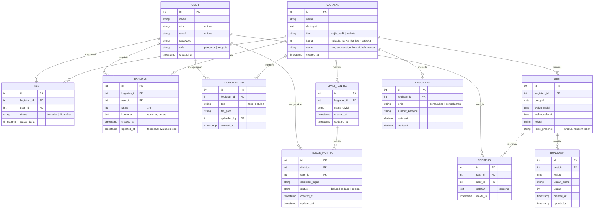
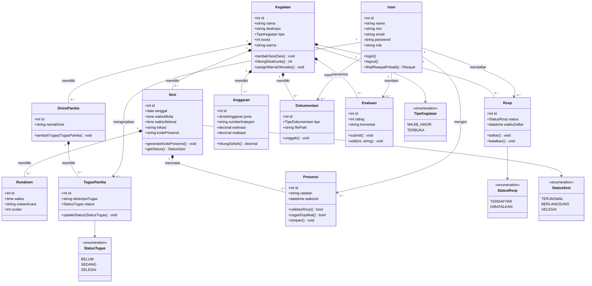
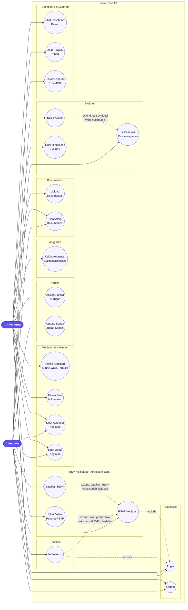
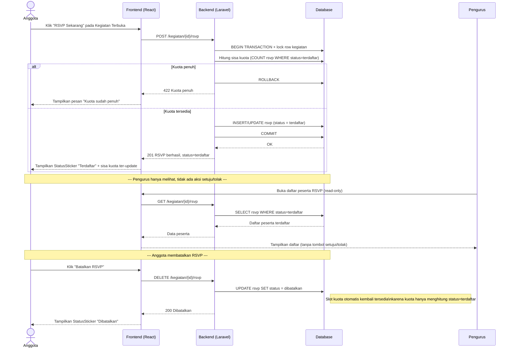
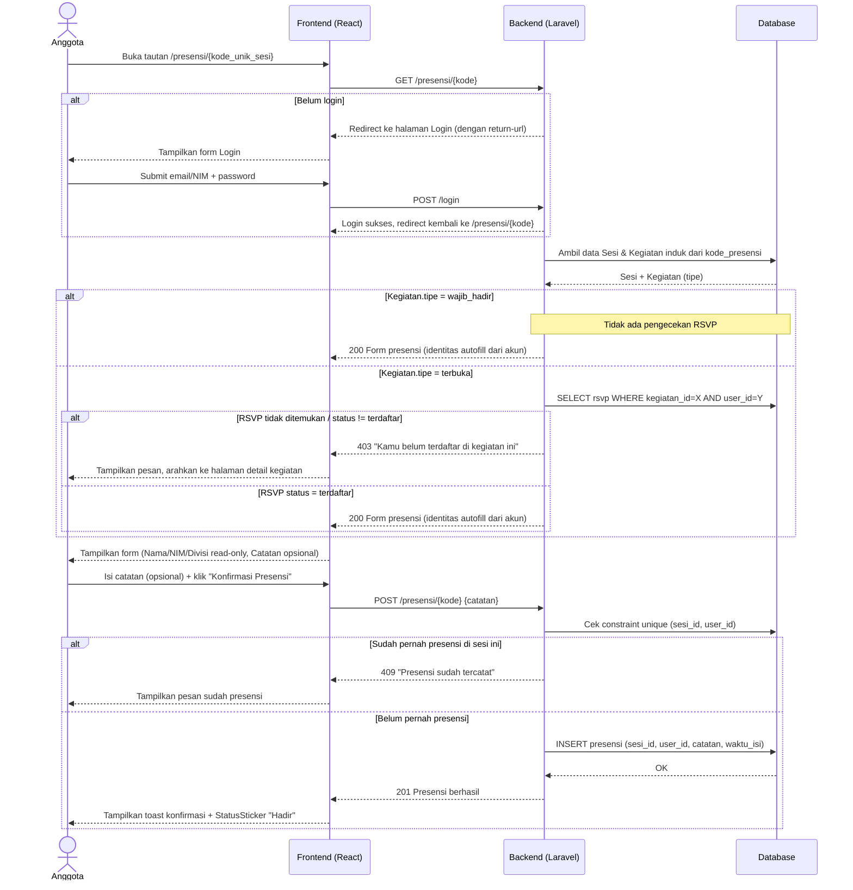
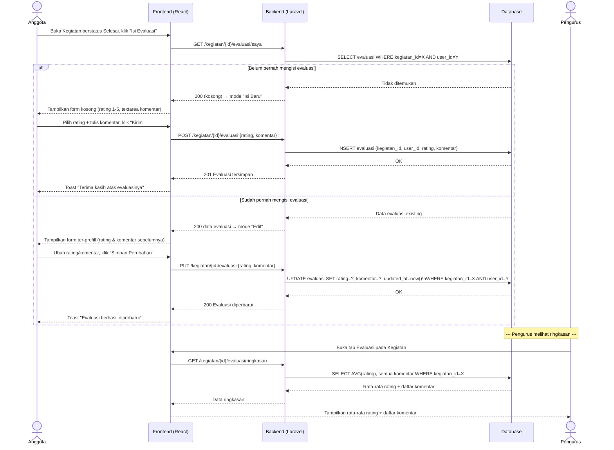

# Dokumen Gabungan — SIGAP

Sistem Informasi Kegiatan, Absensi, dan Pelaporan

Digabung otomatis dari `dokumen_SIGAP.zip` (11 file) menjadi satu file markdown.

## Daftar Isi

1. [Software Requirements Specification (SRS)](#software-requirements-specification-srs)
2. [SKILL.md — Konteks Project](#skillmd-konteks-project)
3. [Data Dictionary](#data-dictionary)
4. [Entity Relationship Diagram (ERD)](#entity-relationship-diagram-erd)
5. [Class Diagram](#class-diagram)
6. [Use Case Diagram](#use-case-diagram)
7. [Sequence Diagram — RSVP](#sequence-diagram-rsvp)
8. [Sequence Diagram — Presensi](#sequence-diagram-presensi)
9. [Sequence Diagram — Evaluasi](#sequence-diagram-evaluasi)
10. [Daftar Endpoint / Route API](#daftar-endpoint-route-api)
11. [Task Breakdown Harian](#task-breakdown-harian)


---

# Software Requirements Specification (SRS)
*(sumber: `SRS.md`)*

# Software Requirements Specification (SRS)
## SIGAP — Sistem Informasi Kegiatan, Absensi, dan Pelaporan

Proyek PKL — Institut Digital Ekonomi LPKIA Bandung
Disusun oleh: Salira Restu Gusti
Skala pengerjaan: 1 bulan (4 minggu efektif)

---

## 1. Pendahuluan

### 1.1 Tujuan Dokumen
Dokumen ini merinci kebutuhan fungsional dan non-fungsional dari platform SIGAP, sebagai acuan pengembangan selama masa PKL, diturunkan langsung dari Proposal Pengajuan Proyek PKL SIGAP dan disusun mengikuti timeline 4 minggu yang telah ditetapkan.

### 1.2 Ruang Lingkup Produk
SIGAP adalah platform manajemen kegiatan (event organizer) terpusat untuk organisasi mahasiswa, mencakup: jadwal & rundown kegiatan, manajemen panitia, pendaftaran/RSVP peserta, presensi digital, manajemen anggaran sederhana, arsip dokumentasi, evaluasi pasca-kegiatan, dan export laporan gabungan untuk keperluan LPJ (Laporan Pertanggungjawaban).

### 1.3 Definisi & Istilah

| Istilah | Definisi |
|---|---|
| Pengurus / Admin | Anggota organisasi dengan hak kelola penuh atas kegiatan |
| Anggota | Pengguna dengan akun login sendiri yang dapat melihat, RSVP, dan mengisi presensi kegiatan |
| RSVP | Pendaftaran kehadiran sebelum kegiatan berlangsung |
| LPJ | Laporan Pertanggungjawaban kegiatan |
| Divisi Panitia | Kelompok tugas kepanitiaan (Acara, Humas, Logistik, Konsumsi, dst.) |
| Kegiatan | Satu payung acara yang dapat terdiri dari satu atau lebih Sesi (mendukung kegiatan multi-hari) |
| Sesi Kegiatan | Satu unit tanggal/waktu/lokasi di dalam sebuah Kegiatan — kegiatan 1 hari punya 1 sesi, kegiatan multi-hari punya beberapa sesi yang tetap tergabung dalam satu Kegiatan (satu warna, satu identitas) |
| Kode Presensi | Kode/tautan unik per sesi untuk mengisi form presensi (memerlukan login Anggota) |

### 1.4 Referensi
- Proposal Pengajuan Proyek PKL "SIGAP" (2026), Salira Restu Gusti, Teknik Informatika, IDE LPKIA Bandung.
- `design.md` — brief desain UI/UX SIGAP (dokumen terpisah, satu paket dengan SRS ini).

---

## 2. Deskripsi Umum

### 2.1 Perspektif Produk
SIGAP adalah aplikasi web baru (bukan pengembangan sistem lama), dibangun dengan **Laravel + Inertia.js + React + TypeScript + Tailwind CSS**, ditujukan sebagai pengganti kombinasi manual (kertas, Google Form, chat WhatsApp, spreadsheet terpisah) yang selama ini dipakai pengurus organisasi mahasiswa.

### 2.2 Fungsi Utama Produk
Merujuk pemetaan solusi pada proposal, sepuluh permasalahan inti (presensi manual, data tersebar, sulit rekap kehadiran, tidak ada riwayat terpusat, info tercecer di WA, jadwal tidak diketahui tepat waktu, sulit lihat keaktifan anggota, tidak ada reminder, LPJ sulit disusun, dokumentasi tercecer) dijawab lewat modul: **Kegiatan & Rundown, RSVP, Presensi Digital, Panitia, Anggaran, Dokumentasi, Evaluasi, Dashboard Rekap, dan Export Laporan.**

### 2.3 Karakteristik Pengguna

| Peran | Deskripsi | Hak Akses Utama |
|---|---|---|
| **Anggota** | Mahasiswa anggota organisasi, memiliki akun login sendiri | Lihat kegiatan, RSVP, isi presensi (tervalidasi akun), isi evaluasi, lihat riwayat pribadi |
| **Pengurus (Admin)** | Pengurus/panitia inti organisasi | Semua hak anggota + CRUD kegiatan & sesi, kelola panitia, anggaran, dokumentasi, dashboard rekap, export laporan |

### 2.4 Batasan Sistem
- Skala pengerjaan versi ini dibatasi 1 bulan/4 minggu — setiap modul dikerjakan dalam **versi sederhana** (lihat catatan proposal §XI): manajemen panitia cukup assign anggota + status tugas (tanpa notifikasi otomatis), anggaran cukup estimasi/realisasi tanpa laporan keuangan mendalam.
- Fitur QR Code presensi, notifikasi H-1 otomatis, generate undangan digital, approval izin/sakit, validasi geolocation, dan filter multi-divisi/multi-unit **tidak termasuk** dalam ruang lingkup versi ini — dicatat sebagai pengembangan tahap lanjutan (lihat §9).
- Kalender kegiatan menggunakan library **FullCalendar** (`@fullcalendar/react`) sebagai komponen utama navigasi kegiatan.
- Satu Kegiatan dapat memiliki lebih dari satu Sesi (tanggal/waktu berbeda) untuk mendukung acara multi-hari; seluruh sesi dalam satu Kegiatan tetap tampil dengan satu warna yang sama di kalender.
- Seluruh peserta kegiatan (baik tipe Wajib Hadir maupun Terbuka) dibatasi pada **Anggota organisasi yang sudah terdaftar** di sistem. Pendaftaran peserta eksternal/tamu di luar organisasi (mis. mahasiswa umum untuk seminar terbuka) **tidak termasuk** dalam ruang lingkup versi ini — SIGAP versi PKL ini fokus sebagai alat bantu *event organizer internal* organisasi, bukan platform pendaftaran publik (lihat §9).
- **Status Sesi** (Terjadwal/Berlangsung/Selesai) **dihitung on-the-fly** (computed attribute, membandingkan waktu saat ini terhadap `waktu_mulai`/`waktu_selesai`), **bukan** kolom tersimpan yang di-update lewat scheduled job/cron. Ini sengaja dipilih untuk menghindari kebutuhan infrastruktur cron yang dianggap berlebihan untuk scope 1 bulan — lihat detail di `SIGAP-DataDictionary.md` §3.

### 2.5 Pustaka Pihak Ketiga yang Diputuskan

| Kebutuhan | Pustaka | Catatan |
|---|---|---|
| Autentikasi | `laravel/fortify` | Bawaan Laravel React Starter Kit (Inertia). Fitur registrasi publik dinonaktifkan (lihat `SIGAP-API-Endpoints.md` §0) |
| Kalender | `@fullcalendar/react` | Sudah diputuskan sejak awal, lihat `design.md` §6 |
| Export Excel | `maatwebsite/excel` | Standar de-facto ekosistem Laravel untuk export/import Excel |
| Export PDF | `barryvdh/laravel-dompdf` | Standar de-facto ekosistem Laravel untuk generate PDF dari HTML/Blade |
| Storage dokumentasi | Laravel local disk (`storage/app/public`) | Cukup untuk scope PKL 1 bulan; migrasi ke cloud storage (S3, dst.) dicatat sebagai pengembangan lanjutan jika kebutuhan storage membesar |

### 2.6 Asumsi
- Satu organisasi per instansi database pada versi ini (belum multi-tenant/multi-unit).
- Seluruh Anggota memiliki akun login (dibuat oleh Pengurus atau registrasi mandiri dengan NIM terverifikasi terhadap data anggota organisasi) — tidak ada jalur presensi/RSVP tanpa login.
- Akun **Pengurus pertama** (sebelum ada siapa pun di database) dibuat manual lewat **Database Seeder** Laravel saat setup awal, bukan lewat form aplikasi — password sementara wajib diganti saat login pertama. Penambahan/pergantian akun Pengurus berikutnya (mis. pergantian kepengurusan tiap periode) untuk versi PKL ini juga masih lewat seeder/`artisan tinker` manual, **belum** ada halaman UI khusus kelola akun Pengurus (beda dengan kelola akun Anggota yang sudah ada UI-nya, FR-03) — dicatat sebagai pengembangan lanjutan di §9.
- Presensi harus dilakukan dalam kondisi login dan divalidasi terhadap data akun Anggota yang bersangkutan (bukan input teks bebas), untuk mencegah presensi atas nama orang lain.
- Warna setiap Kegiatan bersifat bebas (tidak terikat kategori), namun sistem menjamin dua Kegiatan yang tampil berdekatan di kalender tidak memakai warna yang identik.
- Pengembang tunggal (Salira Restu Gusti) mengerjakan seluruh modul selama masa PKL.

---

## 3. Kebutuhan Fungsional

Kebutuhan fungsional dikelompokkan per modul dan dipetakan ke minggu pengerjaan sesuai timeline proyek.

### 3.1 Modul Autentikasi *(Minggu 2)*
| ID | Kebutuhan | Aktor |
|---|---|---|
| FR-01 | Sistem menyediakan login dengan email/NIM & password untuk kedua role (Pengurus dan Anggota) | Anggota, Pengurus |
| FR-02 | Sistem menyediakan logout | Anggota, Pengurus |
| FR-03 | Akun Anggota dibuat oleh Pengurus (input massal/manual data anggota) sehingga NIM yang login sudah pasti terdaftar sebagai anggota organisasi yang sah | Pengurus |
| FR-04 | Sistem melindungi seluruh halaman pengelolaan (kegiatan, panitia, anggaran) agar hanya dapat diakses Pengurus yang login, dan seluruh halaman RSVP/presensi/evaluasi agar hanya dapat diakses Anggota yang login | Anggota, Pengurus |

### 3.2 Modul Kegiatan, Jadwal & Rundown *(Minggu 1–2)*
| ID | Kebutuhan | Aktor |
|---|---|---|
| FR-05 | Pengurus dapat menambah Kegiatan baru (nama, **tipe: Wajib Hadir atau Terbuka+RSVP**, kuota — hanya berlaku jika tipe Terbuka, deskripsi) beserta satu atau lebih Sesi (tanggal, waktu mulai/selesai, lokasi per sesi) — mendukung kegiatan satu hari maupun multi-hari | Pengurus |
| FR-06 | Pengurus dapat mengedit dan menghapus data Kegiatan beserta sesi-sesinya (tambah/hapus sesi individual tanpa membuat Kegiatan baru) | Pengurus |
| FR-07 | Pengurus dapat menyusun rundown acara (baris waktu + uraian acara per baris) untuk tiap Sesi | Pengurus |
| FR-08 | Sistem menampilkan seluruh Sesi dari seluruh Kegiatan dalam tampilan kalender (FullCalendar) dengan status visual (Terjadwal/Berlangsung/Selesai) per sesi | Anggota, Pengurus |
| FR-09 | Anggota & Pengurus dapat mengklik sebuah event/sesi di kalender untuk membuka kartu detail Kegiatan (rundown, panitia, RSVP/kuota jika tipe Terbuka, dst. sesuai role); jika Kegiatan multi-hari, kartu detail menampilkan seluruh sesi terkait dalam satu tampilan | Anggota, Pengurus |
| FR-10 | Setiap Kegiatan memiliki satu warna unik yang otomatis di-assign sistem (dapat diubah manual oleh Pengurus) dan diterapkan konsisten ke seluruh sesi milik Kegiatan tersebut, sehingga sesi-sesi dari kegiatan multi-hari yang sama tetap terlihat sebagai satu identitas warna di kalender | Sistem, Pengurus |
| FR-11 | Kalender mendukung tampilan Bulan, Minggu, dan Agenda (list) | Anggota, Pengurus |

### 3.3 Modul Pendaftaran / RSVP *(Minggu 2)*
Modul ini **hanya berlaku untuk Kegiatan bertipe Terbuka**. Kegiatan bertipe Wajib Hadir (mis. rapat rutin) melewati modul ini sepenuhnya — seluruh Anggota otomatis dianggap diundang tanpa perlu mendaftar, dan bisa langsung mengisi presensi begitu sesi dimulai (lihat FR-16).

RSVP disederhanakan menjadi **satu alur saja (instant)** — begitu Anggota RSVP, langsung mendapat slot selama kuota masih tersedia, **tanpa proses persetujuan Pengurus**. Ini keputusan sadar untuk menjaga scope tetap realistis untuk 1 bulan/1 developer: HMIF sendiri tidak punya kebutuhan menyeleksi peserta acara, RSVP di sini murni soal mengelola kuota tempat/kursi, bukan seleksi siapa yang boleh ikut.

RSVP berada di **level Kegiatan** (bukan per Sesi) — satu kali RSVP otomatis berlaku untuk seluruh sesi dalam Kegiatan tersebut, termasuk kegiatan multi-hari.

| ID | Kebutuhan | Aktor |
|---|---|---|
| FR-12 | Untuk Kegiatan bertipe **Terbuka**, Anggota yang RSVP langsung mendapat status `terdaftar` selama kuota masih tersedia; jika kuota penuh, sistem menolak dengan pesan jelas | Anggota, Sistem |
| FR-12a | Untuk Kegiatan bertipe **Wajib Hadir**, sistem tidak menampilkan alur RSVP sama sekali — Anggota langsung diarahkan ke opsi presensi begitu sesi berstatus Berlangsung | Sistem |
| FR-12c | Anggota dapat membatalkan RSVP yang sudah diajukan sebelum kegiatan berlangsung; status berubah menjadi `dibatalkan` dan slot kuota yang terpakai kembali tersedia | Anggota |
| FR-13 | Sistem menampilkan status pendaftaran (`terdaftar` / `dibatalkan`) dan sisa kuota secara real-time untuk kegiatan Terbuka. **Kuota terpakai dihitung hanya dari peserta berstatus `terdaftar`** | Anggota, Pengurus, Sistem |
| FR-14 | Pengurus dapat melihat daftar peserta yang RSVP suatu kegiatan Terbuka (read-only — tidak ada aksi setuju/tolak karena RSVP bersifat instant) | Pengurus |

### 3.4 Modul Presensi Digital *(Minggu 2)*
| ID | Kebutuhan | Aktor |
|---|---|---|
| FR-15 | Setiap Sesi kegiatan otomatis mendapatkan kode/tautan presensi unik | Sistem |
| FR-16 | Anggota harus login terlebih dahulu untuk mengisi presensi; identitas (Nama, NIM, Jabatan/Divisi) terisi otomatis dari data akun, bukan input teks bebas — Anggota hanya menambahkan Catatan opsional lalu konfirmasi kehadiran. Untuk Kegiatan bertipe **Terbuka**, presensi **hanya dapat diisi jika status RSVP Anggota tersebut = `terdaftar`** (RSVP yang sudah `dibatalkan` tidak dapat mengisi presensi). Untuk Kegiatan bertipe **Wajib Hadir**, tidak ada syarat RSVP — semua Anggota dapat langsung mengisi presensi | Anggota |
| FR-17 | Sistem memvalidasi bahwa akun yang mengisi presensi memang tercatat sebagai Anggota terdaftar organisasi (dan, khusus Kegiatan Terbuka, tercatat berstatus RSVP "terdaftar") sebelum menyimpan data presensi | Sistem |
| FR-18 | Sistem menyimpan setiap data presensi terhubung ke `user_id` dan Sesi terkait, serta mencegah presensi ganda oleh akun yang sama pada sesi yang sama | Sistem |

### 3.5 Modul Panitia & Pembagian Tugas *(Minggu 3)*
| ID | Kebutuhan | Aktor |
|---|---|---|
| FR-19 | Pengurus dapat meng-assign anggota ke divisi panitia (Acara, Humas, Logistik, Konsumsi, dst.) pada suatu kegiatan | Pengurus |
| FR-20 | Pengurus dapat memberikan checklist tugas per anggota/divisi dengan status (belum/sedang/selesai) | Pengurus |
| FR-21 | Anggota panitia dapat melihat tugas yang diberikan kepadanya dan mengubah status tugasnya sendiri | Anggota |

### 3.6 Modul Anggaran Sederhana *(Minggu 3)*
| ID | Kebutuhan | Aktor |
|---|---|---|
| FR-22 | Pengurus dapat mencatat estimasi anggaran (pemasukan kas/sponsor, pengeluaran konsumsi/venue/doorprize) per kegiatan | Pengurus |
| FR-23 | Pengurus dapat mencatat realisasi anggaran dan sistem menghitung selisih terhadap estimasi | Pengurus |
| FR-24 | Sistem menampilkan ringkasan pemasukan/pengeluaran per kegiatan | Pengurus |

### 3.7 Modul Dokumentasi *(Minggu 3)*
| ID | Kebutuhan | Aktor |
|---|---|---|
| FR-25 | Pengurus dapat mengunggah foto dan notulen kegiatan, terhubung langsung ke record kegiatan terkait | Pengurus |
| FR-26 | Pengurus dan Anggota dapat melihat arsip dokumentasi suatu kegiatan dari kartu detail kegiatan | Anggota, Pengurus |

### 3.8 Modul Evaluasi Pasca-Kegiatan *(Minggu 4)*
Evaluasi disederhanakan menjadi dua input: **rating 1–5** (dipakai untuk statistik rata-rata kepuasan) dan **komentar bebas** (textarea, untuk kritik/saran/masukan). Setiap Anggota hanya mengisi **satu evaluasi per Kegiatan**, tetapi isiannya dapat diedit kembali selama diperlukan.

| ID | Kebutuhan | Aktor |
|---|---|---|
| FR-27 | Anggota dapat mengisi form evaluasi (rating 1–5 + komentar bebas) setelah Kegiatan berstatus Selesai | Anggota |
| FR-27a | Sistem membatasi satu evaluasi per Anggota per Kegiatan (constraint unik `kegiatan_id + user_id`); jika Anggota mengisi ulang, sistem mengarahkan ke mode **edit** evaluasi yang sudah ada, bukan membuat baris baru | Sistem |
| FR-27b | Anggota dapat mengedit rating dan/atau komentar evaluasi yang pernah diisi | Anggota |
| FR-28 | Pengurus dapat melihat ringkasan hasil evaluasi per Kegiatan: rata-rata rating dan daftar komentar | Pengurus |

### 3.9 Modul Dashboard Rekap *(Minggu 4)*
| ID | Kebutuhan | Aktor |
|---|---|---|
| FR-29 | Pengurus dapat melihat dashboard rekap kehadiran per anggota (total lintas kegiatan dalam satu periode) | Pengurus |
| FR-30 | Pengurus dapat melihat dashboard rekap kehadiran per kegiatan | Pengurus |
| FR-31 | Dashboard menampilkan statistik keaktifan gabungan (kehadiran + keterlibatan sebagai panitia) per anggota | Pengurus |
| FR-32 | Anggota dapat melihat riwayat kehadiran dan keikutsertaannya sendiri | Anggota |

### 3.10 Modul Export Laporan *(Minggu 4)*
| ID | Kebutuhan | Aktor |
|---|---|---|
| FR-33 | Pengurus dapat memilih kegiatan/periode tertentu untuk direkap | Pengurus |
| FR-34 | Sistem dapat mengekspor data gabungan (kehadiran, anggaran, evaluasi) ke format Excel | Pengurus |
| FR-35 | Sistem dapat mengekspor data gabungan ke format PDF | Pengurus |

---

## 4. Kebutuhan Non-Fungsional

| ID | Kategori | Kebutuhan |
|---|---|---|
| NFR-01 | Usability | Form presensi (setelah login) harus dapat diisi tanpa training, selesai dalam <15 detik di perangkat mobile karena identitas sudah terisi otomatis dari akun |
| NFR-02 | Performance | Halaman kalender (FullCalendar) memuat data kegiatan bulanan dalam <2 detik pada koneksi kampus standar |
| NFR-03 | Security | Seluruh endpoint pengelolaan kegiatan/panitia/anggaran dilindungi middleware autentikasi Pengurus |
| NFR-04 | Security | Kode/tautan presensi bersifat unik per sesi dan tidak dapat ditebak (random token, bukan sequential ID); mengisi presensi tetap mewajibkan sesi login Anggota yang valid |
| NFR-05 | Compatibility | Antarmuka responsif dan berfungsi baik pada layar mobile (<640px), tablet, dan desktop |
| NFR-06 | Maintainability | Struktur kode mengikuti konvensi Laravel + Inertia.js + React + TypeScript agar mudah dikembangkan pada tahap lanjutan |
| NFR-07 | Reliability | Data presensi tidak boleh hilang meskipun pengisi menutup halaman sebelum konfirmasi — validasi sisi server wajib |
| NFR-08 | Data Integrity | Penghapusan data kegiatan harus mempertimbangkan data terkait (rundown, presensi, RSVP, anggaran, dokumentasi) — gunakan soft delete atau konfirmasi eksplisit |

---

## 5. Kebutuhan Data (Model Entitas)

Entitas inti yang perlu dirancang pada skema database (dikerjakan Minggu 1, sebagai bagian dari desain ERD):

| Entitas | Atribut Kunci | Relasi |
|---|---|---|
| **User** | id, name, NIM, email, password, role (pengurus/anggota) *(kolom `name` — bukan `nama` — mengikuti konvensi bawaan Laravel React Starter Kit/Fortify, satu-satunya pengecualian dari penamaan Bahasa Indonesia di dokumen ini)* | 1–N ke TugasPanitia, RSVP, Presensi, Evaluasi |
| **Kegiatan** | id, nama, deskripsi, **tipe (wajib_hadir / terbuka)**, kuota (nullable, hanya untuk tipe terbuka), warna (hex) | 1–N ke Sesi, Panitia, RSVP, Anggaran, Dokumentasi, Evaluasi |
| **Sesi** | id, kegiatan_id, tanggal, waktu_mulai, waktu_selesai, lokasi, **status (computed on-the-fly, bukan kolom tersimpan — lihat §2.5)**, kode_presensi | N–1 ke Kegiatan; 1–N ke Rundown, Presensi |
| **Rundown** | id, sesi_id, waktu, uraian_acara, urutan | N–1 ke Sesi |
| **DivisiPanitia** | id, kegiatan_id, nama_divisi | 1–N ke TugasPanitia |
| **TugasPanitia** | id, divisi_id, user_id, deskripsi_tugas, status | N–1 ke DivisiPanitia, User |
| **RSVP** | id, kegiatan_id, user_id, status (**terdaftar/dibatalkan**), waktu_daftar | N–1 ke Kegiatan, User — RSVP berlaku untuk seluruh Kegiatan (bukan per sesi), karena satu pendaftaran sudah mencakup semua sesi multi-hari. Constraint unik `kegiatan_id + user_id` (satu Anggota hanya punya satu baris RSVP aktif per Kegiatan) |
| **Presensi** | id, sesi_id, user_id, catatan, waktu_isi | N–1 ke Sesi, User — identitas (nama/NIM/jabatan) diambil dari relasi User, bukan disimpan ulang sebagai teks |
| **Anggaran** | id, kegiatan_id, jenis (pemasukan/pengeluaran), sumber_kategori, estimasi, realisasi | N–1 ke Kegiatan |
| **Dokumentasi** | id, kegiatan_id, tipe (foto/notulen), file_path, uploaded_by | N–1 ke Kegiatan |
| **Evaluasi** | id, kegiatan_id, user_id, rating (1–5), komentar, updated_at | N–1 ke Kegiatan, User — constraint unik `kegiatan_id + user_id` (satu evaluasi per Anggota per Kegiatan, dapat diedit) |

> **Catatan desain:** pemisahan Kegiatan ↔ Sesi adalah kunci untuk mendukung acara multi-hari — satu Kegiatan (nama, warna, kuota RSVP) bisa punya banyak Sesi (tanggal/jam/lokasi berbeda tiap hari), masing-masing dengan rundown dan presensinya sendiri, tapi tetap tampil sebagai satu identitas warna yang sama di kalender.

---

## 6. Kebutuhan Antarmuka

- **Antarmuka Kalender:** wajib menggunakan FullCalendar (`@fullcalendar/react`) dengan plugin `dayGrid`, `timeGrid`, `list`, `interaction`. Setiap event di kalender merepresentasikan satu Sesi, dengan warna diambil dari `Kegiatan.warna` (bukan kategori) sehingga sesi-sesi dari Kegiatan multi-hari yang sama tampil dengan warna identik. Struktur event & perilaku `eventClick` mengikuti spesifikasi pada `design.md` §6.
- **Antarmuka Detail Kegiatan:** dibuka sebagai panel slide-in/bottom-sheet saat event kalender diklik, bukan halaman terpisah; jika Kegiatan memiliki >1 sesi, panel menampilkan selector/tab tanggal untuk berpindah antar sesi (lihat `design.md` §4 & §6).
- **Antarmuka Form Presensi:** halaman `/presensi/{kode_unik_sesi}`, mewajibkan Anggota login terlebih dahulu (redirect ke login jika belum), lalu menampilkan identitas ter-autofill dari akun untuk dikonfirmasi.
- **Antarmuka Export:** tombol export tersedia dari Dashboard Rekap dan dari kartu detail kegiatan (export per-kegiatan maupun per-periode).

---

## 7. Matriks Kebutuhan vs Timeline

| Minggu | Modul Dikerjakan | Kebutuhan Terkait |
|---|---|---|
| Minggu 1 | Analisis, wireframe, desain ERD | Dasar seluruh FR & entitas §5 |
| Minggu 2 | Setup project, Kegiatan & Rundown, RSVP, Presensi | FR-05 s/d FR-18 |
| Minggu 3 | Panitia, Anggaran, Dokumentasi, testing modul 1–3 | FR-19 s/d FR-26 |
| Minggu 4 | Evaluasi, Dashboard Rekap, Export, testing akhir, dokumentasi teknis, presentasi | FR-27 s/d FR-35 |

---

## 8. Target Output (mengacu Proposal §XII)

1. Platform manajemen kegiatan & presensi organisasi yang berfungsi dengan baik, mencakup seluruh modul inti (panitia, rundown, RSVP, presensi, anggaran, dokumentasi, evaluasi).
2. Dokumentasi teknis sistem (struktur database dan alur sistem).
3. Laporan hasil pelaksanaan PKL.

---

## 9. Pengembangan Tahap Lanjutan (Di Luar Ruang Lingkup Versi Ini)

Sesuai proposal §XIV, berikut fitur yang **sengaja tidak termasuk** dalam SRS versi 1 bulan ini dan dicatat sebagai kandidat pengembangan lanjutan:

- QR Code Presensi (menggantikan input kode/tautan manual)
- Reminder/Notifikasi Otomatis (email/WhatsApp H-1)
- Generate Undangan Digital otomatis untuk pihak formal
- Approval Izin/Sakit oleh anggota
- Validasi Lokasi (Geolocation) saat presensi
- Filter Multi-Divisi/Multi-Unit (mendukung banyak sub-organisasi **di dalam satu organisasi yang sama**, mis. HMIF punya banyak divisi internal)
- **Dukungan multi-tenant** — platform dipakai lintas **organisasi/instansi yang berbeda** (bukan cuma satu HMIF, tapi bisa banyak himpunan/organisasi lain berbagi satu instalasi SIGAP dengan data terisolasi per organisasi). Ini berbeda dari poin filter multi-divisi di atas (yang masih dalam satu organisasi)
- Pendaftaran peserta eksternal/tamu di luar Anggota terdaftar (mis. membuka Kegiatan Terbuka untuk mahasiswa umum di luar organisasi, dengan alur registrasi tamu tanpa akun penuh)
- Halaman UI kelola akun Pengurus (tambah/hapus/edit sesama Pengurus dari aplikasi) — untuk versi PKL ini masih lewat Database Seeder/`artisan tinker` manual (lihat §2.6); pengembangan lanjutannya cukup meniru pola CRUD akun Anggota yang sudah ada

---

## 10. Keputusan Desain (Hasil Klarifikasi)

Empat pertanyaan terbuka pada draf sebelumnya telah dijawab dan diterapkan ke seluruh dokumen ini:

| # | Pertanyaan | Keputusan |
|---|---|---|
| 1 | Anggota perlu akun login? | **Ya.** Anggota memiliki akun login sendiri (dibuat Pengurus / registrasi dengan verifikasi NIM); tidak ada jalur presensi/RSVP tanpa login (FR-01–FR-04). |
| 2 | Skema warna kalender? | **Bebas per-Kegiatan**, tidak terikat kategori tetap. Sistem auto-assign warna unik ke tiap Kegiatan, Pengurus dapat override manual (FR-10). |
| 3 | Kegiatan multi-hari? | **Didukung.** Kegiatan dipisah dari Sesi (1 Kegiatan → N Sesi); tiap sesi punya tanggal/waktu/lokasi/rundown/presensi sendiri, tapi seluruh sesi tetap mewarisi satu warna Kegiatan yang sama (FR-05, FR-06, §5). |
| 4 | Validasi presensi? | **Tervalidasi terhadap akun Anggota.** Identitas presensi diambil dari data akun yang login, bukan input teks bebas (FR-16, FR-17, §5). |
| 5 | Siapa yang RSVP, dan untuk kegiatan apa? | **Campuran.** Kegiatan punya atribut `tipe`: **Wajib Hadir** (rapat rutin dsb — semua Anggota otomatis diundang, tanpa RSVP, langsung presensi) vs **Terbuka** (seminar/workshop dsb — perlu RSVP dulu, dibatasi kuota, presensi hanya untuk yang RSVP-nya berstatus "terdaftar") (FR-05, FR-12, FR-12a, FR-16). |
| 7 | Apakah RSVP perlu proses persetujuan Pengurus? | **Tidak.** RSVP disederhanakan jadi satu alur instant saja — HMIF tidak punya kebutuhan menyeleksi peserta, RSVP murni soal kuota tempat. Anggota RSVP → langsung `terdaftar` selama kuota ada, bisa `dibatalkan` kapan saja (FR-12, FR-12c). Mode Approval yang sempat dirancang dihapus dari scope (lihat §11 v1.3). |
| 8 | Bagaimana kuota dihitung & bagaimana bentuk evaluasi? | **Kuota** hanya menghitung peserta berstatus `terdaftar` (FR-13). **Evaluasi** disederhanakan jadi rating 1–5 + komentar bebas, satu per Anggota per Kegiatan, dan dapat diedit ulang (FR-27, FR-27a, FR-27b). |

Tidak ada lagi pertanyaan terbuka yang menghambat mulai pengerjaan Minggu 1.

---

## 11. Riwayat Revisi

| Versi | Perubahan |
|---|---|
| v1.0 | Draf awal berdasarkan Proposal PKL SIGAP. |
| v1.1 | Klarifikasi: akun login Anggota, warna bebas per-Kegiatan, dukungan multi-sesi, scope event organizer internal (lihat §10 item 1–6). |
| v1.2 | Hasil pembahasan lanjutan (sesuai `perubahan srs yang terjadi.txt`): (a) RSVP dibuat fleksibel dengan mode **Instant** vs **Approval** per Kegiatan, ditambah status `dibatalkan`; (b) kuota dihitung hanya dari RSVP berstatus `terdaftar`; (c) presensi Kegiatan Terbuka ditegaskan hanya untuk RSVP `terdaftar`; (d) Evaluasi disederhanakan jadi rating 1–5 + komentar bebas, satu evaluasi per Anggota per Kegiatan namun dapat diedit (lihat §10 item 7–8). Struktur inti (Pengurus/Anggota, Kegiatan Wajib Hadir/Terbuka, Sesi, Presensi, Panitia, Anggaran, Dokumentasi, Dashboard, Export) tidak berubah.
| v1.3 | **Penyederhanaan RSVP setelah refleksi kebutuhan riil.** Mode Approval dihapus sepenuhnya dari scope — RSVP kembali ke satu alur instant (daftar → langsung `terdaftar` selama kuota ada → bisa dibatalkan). Alasan: HMIF tidak punya kebutuhan menyeleksi peserta acara (dikonfirmasi user), dan kompleksitas approval (state `menunggu`/`ditolak`, endpoint setujui/tolak, UI kelola peserta) tidak sepadan untuk scope 1 bulan/1 developer. Field `mode_rsvp` di Kegiatan dan status `menunggu`/`ditolak` di RSVP dihapus dari model data. FR-12b dan FR-14a dihapus; FR-13 dan FR-14 disederhanakan. Modul lain tidak terpengaruh.
| v1.4 | **Audit konsistensi antara dokumen analisis dan `SIGAP-Tutorial-Setup.md`.** Ditemukan dan diperbaiki: (a) entitas User memakai kolom `name` (bukan `nama`) — mengikuti konvensi bawaan Laravel React Starter Kit/Fortify yang sudah dipakai di kode tutorial, disamakan di seluruh dokumen; (b) field `status_default` di entitas Kegiatan dihapus — sisa draf awal sebelum status dipindah jadi computed attribute milik Sesi, tidak pernah diimplementasikan; (c) kolom `created_at`/`updated_at` ditambahkan ke dokumentasi tabel `rundown`, `divisi_panitia`, `tugas_panitia` di ERD & Data Dictionary agar sesuai migration yang sudah ditulis di tutorial. Tidak ada perubahan pada logika bisnis atau scope fitur.

**Dokumen analisis pendamping** (satu paket dengan SRS ini, ada di folder yang sama):
- `design.md` — brief desain UI/UX
- `SIGAP-UseCaseDiagram.mermaid` — diagram use case
- `SIGAP-ERD.mermaid` — entity relationship diagram
- `SIGAP-DataDictionary.md` — kamus data lengkap tiap tabel
- `SIGAP-ClassDiagram.mermaid` — class diagram
- `SIGAP-SequenceDiagram-RSVP.mermaid` — sequence diagram alur RSVP (instant-only, lihat v1.3)
- `SIGAP-SequenceDiagram-Presensi.mermaid` — sequence diagram alur presensi
- `SIGAP-SequenceDiagram-Evaluasi.mermaid` — sequence diagram alur evaluasi (isi & edit)
- `SIGAP-StateDiagram-RSVP.mermaid` — state diagram status RSVP
- `SIGAP-StateDiagram-Sesi.mermaid` — state diagram status Sesi

---

# SKILL.md — Konteks Project
*(sumber: `SKILL.md`)*

---
name: sigap-project-context
description: Konteks lengkap project SIGAP (Sistem Informasi Kegiatan, Absensi, dan Pelaporan) — platform manajemen kegiatan organisasi mahasiswa untuk PKL Salira Restu Gusti di Teknik Informatika, IDE LPKIA Bandung. WAJIB dipakai setiap kali mengerjakan apa pun yang berkaitan dengan SIGAP: menulis kode (Laravel/Inertia/React/TypeScript/Fortify), membuat atau merevisi dokumen analisis (SRS, ERD, use case, sequence/state diagram, data dictionary), mendesain UI/kalender FullCalendar, menyusun timeline/task breakdown, atau menjawab pertanyaan tentang requirement/scope/keputusan desain proyek ini. Jangan menjawab dari asumsi/tebakan soal SIGAP — selalu cek skill ini dan dokumen pendamping yang dirujuk di dalamnya dulu, karena banyak keputusan (terutama soal RSVP) sudah direvisi beberapa kali dan versi lama tidak berlaku lagi.
---

# SIGAP — Project Context

Skill ini merangkum keputusan final proyek SIGAP supaya kerja lanjutan (coding, revisi dokumen, atau sesi AI baru) nggak perlu re-derive dari nol atau salah pakai keputusan versi lama yang udah direvisi.

## Ringkasan Proyek

**SIGAP** = Sistem Informasi Kegiatan, Absensi, dan Pelaporan — platform manajemen kegiatan (event organizer) **internal** untuk organisasi mahasiswa (HMIF, Teknik Informatika, IDE LPKIA Bandung). Dikerjakan solo oleh Salira Restu Gusti sebagai proyek PKL, skala **1 bulan / 20 hari kerja**.

**Stack:** Laravel 12 (React Starter Kit) + Inertia + React + TypeScript + Tailwind + Fortify (auth) + FullCalendar (`@fullcalendar/react`).

**Scope inti:** kalender kegiatan, RSVP, presensi digital, manajemen panitia, anggaran sederhana, dokumentasi, evaluasi pasca-kegiatan, dashboard rekap, export laporan (Excel/PDF).

**Di luar scope versi ini (dicatat sebagai pengembangan lanjutan, JANGAN diimplementasikan kecuali user eksplisit minta):** peserta eksternal/tamu di luar Anggota terdaftar, dukungan multi-tenant lintas organisasi, UI kelola akun Pengurus, notifikasi otomatis, QR code presensi, approval izin/sakit, validasi geolocation.

## Keputusan Final yang WAJIB Diikuti (sering salah kalau nebak)

Ini poin-poin yang paling sering direvisi selama analisis — pastikan versi TERBARU ini yang dipakai, bukan asumsi umum:

1. **Dua role saja:** `pengurus` dan `anggota`. Anggota WAJIB punya akun login sendiri (bukan guest/tanpa akun). Akun Anggota hanya dibuat oleh Pengurus (tidak ada self-register publik — `Features::registration()` Fortify dimatikan).
2. **Akun Pengurus pertama** dibuat manual lewat Database Seeder (bukan lewat form aplikasi) — solusi buat chicken-and-egg problem karena Anggota/Pengurus lain cuma bisa dibuat oleh Pengurus yang udah login.
3. **Kegiatan punya dua tipe:** `wajib_hadir` (rapat rutin dst — semua Anggota otomatis boleh hadir, TIDAK ada RSVP, langsung presensi) vs `terbuka` (workshop/seminar dst — ada kuota, WAJIB RSVP dulu sebelum bisa presensi).
4. **RSVP versi final itu SEDERHANA (instant-only)** — ini titik yang paling sering salah diasumsikan karena sempat ada draf lebih kompleks yang sudah DIBATALKAN:
   - Cuma 2 status: `terdaftar` dan `dibatalkan`.
   - TIDAK ADA mode approval, TIDAK ADA status `menunggu`/`ditolak`, TIDAK ADA Pengurus menyetujui/menolak satu-satu.
   - Anggota RSVP → langsung `terdaftar` selama kuota masih ada. Kuota cuma dihitung dari status `terdaftar`.
   - RSVP di level **Kegiatan**, bukan per Sesi — satu RSVP berlaku untuk semua sesi kegiatan multi-hari.
   - Presensi Kegiatan Terbuka HANYA bisa diisi kalau status RSVP Anggota = `terdaftar`.
5. **Kegiatan bisa multi-hari** — dipisah jadi entitas `Kegiatan` (induk: nama, tipe, kuota, warna) dan `Sesi` (anak: tanggal, jam, lokasi, kode presensi — bisa lebih dari satu per Kegiatan). Rundown & presensi nempel ke Sesi, bukan ke Kegiatan langsung.
6. **Status Sesi (`terjadwal`/`berlangsung`/`selesai`) itu COMPUTED, BUKAN kolom database.** Dihitung on-the-fly dari `waktu_mulai`/`waktu_selesai` vs waktu sekarang (accessor di model). **Sengaja TIDAK pakai cron/scheduled job** — keputusan sadar untuk menghindari kompleksitas infrastruktur yang nggak sepadan untuk scope 1 bulan.
7. **Warna kegiatan itu bebas per-Kegiatan** (auto-assign dari palet 10 warna, bisa diubah manual Pengurus), BUKAN warna tetap per kategori. Semua sesi dari Kegiatan yang sama otomatis mewarisi warna yang sama (pakai `groupId` di FullCalendar).
8. **Evaluasi:** rating 1–5 + komentar bebas (textarea). Satu evaluasi per Anggota per Kegiatan (constraint unik `kegiatan_id+user_id`), tapi BISA diedit ulang — submit kedua = update, bukan insert baru.
9. **Library export:** `maatwebsite/excel` (Excel) + `barryvdh/laravel-dompdf` (PDF). *(Catatan: `barryvdh` TIDAK punya package Excel yang aktif dipelihara — jangan salah pakai fork lamanya.)*
10. **Storage dokumentasi:** local disk (`storage/app/public`), bukan cloud — cukup untuk scope PKL.
11. **Kolom nama User pakai `name` (bukan `nama`)** — satu-satunya pengecualian dari konvensi Bahasa Indonesia di seluruh dokumen, sengaja dipertahankan karena itu kolom bawaan Laravel React Starter Kit/Fortify (dipakai komponen profil, dst). Semua tabel lain (kegiatan.nama, divisi_panitia.nama_divisi, dst) tetap Bahasa Indonesia.

## Dokumen Pendamping — Kapan Dirujuk

Semua di folder yang sama dengan skill ini. **Baca yang relevan sebelum kerja, jangan cuma modal skill ini doang** — skill ini ringkasan, bukan pengganti detail lengkap.

| File | Konsultasi kalau... |
|---|---|
| `SRS.md` | Butuh nomor FR/NFR spesifik, riwayat revisi lengkap (v1.0–v1.3), atau alasan di balik suatu keputusan |
| `SIGAP-ERD.mermaid` | Butuh lihat relasi antar tabel |
| `SIGAP-DataDictionary.md` | Nulis migration — nama kolom, tipe data, constraint, aturan bisnis persis |
| `SIGAP-ClassDiagram.mermaid` | Butuh struktur OOP/model |
| `SIGAP-UseCaseDiagram.mermaid` | Butuh cek siapa boleh ngapain |
| `SIGAP-SequenceDiagram-RSVP.mermaid` | Implementasi endpoint RSVP — urutan request persis |
| `SIGAP-SequenceDiagram-Presensi.mermaid` | Implementasi endpoint presensi — urutan validasi persis |
| `SIGAP-SequenceDiagram-Evaluasi.mermaid` | Implementasi endpoint evaluasi (isi vs edit) |
| `SIGAP-StateDiagram-RSVP.mermaid` | Cek transisi status RSVP yang valid |
| `SIGAP-StateDiagram-Sesi.mermaid` | Cek transisi status Sesi & kaitannya ke RSVP/presensi/evaluasi |
| `design.md` | Kerja apa pun soal UI — token warna, tipografi, komponen, spek FullCalendar, struktur halaman |
| `SIGAP-API-Endpoints.md` | Butuh daftar route lengkap (method, path, request, role) |
| `SIGAP-Tutorial-Setup.md` | Mulai coding dari nol — migration, model, seeder, middleware, contoh modul Kegiatan+Kalender |
| `SIGAP-TaskBreakdown-Harian.md` | Butuh tau urutan kerja per hari + cut list kalau waktu mepet |
| `SIGAP_Timeline_PKL.xlsx` | Butuh lihat jadwal Gantt visual |

## Kalau Ada Instruksi yang Kontradiksi Skill Ini

Kalau di percakapan baru user minta sesuatu yang beda dari poin-poin di atas (misal "tambahin lagi mode approval RSVP" atau "bikin multi-tenant"), **itu valid sebagai instruksi baru** — user boleh mengubah keputusan kapan saja. Tapi update juga skill ini dan dokumen terkait (terutama `SRS.md` bagian Riwayat Revisi) supaya tetap jadi satu sumber kebenaran yang konsisten, bukan biarin skill ini jadi basi.

---

# Data Dictionary
*(sumber: `SIGAP-DataDictionary.md`)*

# Data Dictionary — SIGAP
Sistem Informasi Kegiatan, Absensi, dan Pelaporan

Kamus data ini merinci setiap tabel pada `SIGAP-ERD.mermaid`, termasuk tipe data, constraint, dan aturan bisnis yang tidak bisa ditangkap oleh diagram ER saja. Dipakai sebagai acuan langsung saat menulis migration Laravel.

---

## 1. `users`

| Kolom | Tipe | Constraint | Keterangan |
|---|---|---|---|
| id | bigint | PK, auto-increment | |
| name | varchar(255) | not null | **Kolom bawaan Laravel React Starter Kit — bukan `nama`.** Satu-satunya pengecualian dari konvensi Bahasa Indonesia di kamus data ini, sengaja dipertahankan supaya nyambung dengan komponen bawaan starter kit (halaman profil, Fortify) tanpa perlu modifikasi tambahan |
| nim | varchar(20) | unique, not null | Dipakai sebagai identitas login alternatif & validasi keanggotaan |
| email | varchar(255) | unique, not null | Kolom bawaan Laravel, tidak dimodifikasi |
| password | varchar(255) | not null | Di-hash (bcrypt) |
| role | enum('pengurus','anggota') | not null, default 'anggota' | |
| created_at, updated_at | timestamp | nullable | Laravel default timestamps |

**Aturan bisnis:** akun `anggota` hanya dibuat oleh `pengurus` (input manual/massal) — tidak ada self-registration bebas, memastikan NIM yang terdaftar memang anggota organisasi sah (FR-03).

---

## 2. `kegiatan`

| Kolom | Tipe | Constraint | Keterangan |
|---|---|---|---|
| id | bigint | PK, auto-increment | |
| nama | varchar(150) | not null | |
| deskripsi | text | nullable | |
| tipe | enum('wajib_hadir','terbuka') | not null | Menentukan apakah modul RSVP aktif |
| kuota | int unsigned | nullable | **Wajib diisi jika `tipe = terbuka`**, null jika `wajib_hadir` |
| warna | char(7) | not null, default auto-generate | Format hex `#RRGGBB`, diambil dari palet warna kegiatan (lihat `design.md` §3.1b) |
| created_at, updated_at | timestamp | nullable | |

**Aturan bisnis:**
- Jika `tipe = wajib_hadir`, kolom `kuota` harus `NULL` (validasi di level aplikasi, bukan hanya constraint DB).
- `warna` sebaiknya di-generate saat insert (hash `id`/`nama` terhadap indeks palet 10 warna) agar dua kegiatan yang berdekatan tanggal tidak bertabrakan warna.

---

## 3. `sesi`

| Kolom | Tipe | Constraint | Keterangan |
|---|---|---|---|
| id | bigint | PK, auto-increment | |
| kegiatan_id | bigint | FK → `kegiatan.id`, not null, on delete cascade | |
| tanggal | date | not null | |
| waktu_mulai | time | not null | |
| waktu_selesai | time | not null | Harus > `waktu_mulai` (validasi aplikasi) |
| lokasi | varchar(200) | not null | |
| kode_presensi | varchar(32) | unique, not null | Random token (bukan sequential), di-generate saat sesi dibuat |
| created_at, updated_at | timestamp | nullable | |

**`status` BUKAN kolom database.** Status (`terjadwal` / `berlangsung` / `selesai`) dihitung **on-the-fly** lewat accessor di model `Sesi`, membandingkan `now()` terhadap `tanggal + waktu_mulai` dan `tanggal + waktu_selesai`:

```php
public function getStatusAttribute(): string
{
    $mulai = $this->tanggal->copy()->setTimeFrom($this->waktu_mulai);
    $selesai = $this->tanggal->copy()->setTimeFrom($this->waktu_selesai);
    $now = now();

    if ($now->lt($mulai)) return 'terjadwal';
    if ($now->between($mulai, $selesai)) return 'berlangsung';
    return 'selesai';
}
```

**Kenapa bukan kolom + cron job?** Untuk scope PKL 1 bulan, menjalankan Laravel Scheduler (cron) di server hanya untuk update satu kolom status dianggap kompleksitas infrastruktur yang tidak sepadan. Menghitung on-the-fly menghilangkan risiko status "telat update" sekaligus menghilangkan kebutuhan cron sama sekali — trade-off-nya cuma sedikit komputasi ekstra tiap request, yang untuk skala organisasi mahasiswa sama sekali tidak signifikan.

**Aturan bisnis:** presensi (`presensi.sesi_id`) dan rundown (`rundown.sesi_id`) selalu merujuk ke `sesi`, bukan `kegiatan` langsung — memungkinkan tiap hari dari kegiatan multi-hari punya presensi & rundown terpisah.

---

## 4. `rundown`

| Kolom | Tipe | Constraint | Keterangan |
|---|---|---|---|
| id | bigint | PK, auto-increment | |
| sesi_id | bigint | FK → `sesi.id`, not null, on delete cascade | |
| waktu | time | not null | |
| uraian_acara | varchar(255) | not null | |
| urutan | int unsigned | not null | Untuk pengurutan tampilan (bukan hanya sort by `waktu`, agar Pengurus bisa reorder manual) |
| created_at, updated_at | timestamp | nullable | Laravel default timestamps |

---

## 5. `divisi_panitia`

| Kolom | Tipe | Constraint | Keterangan |
|---|---|---|---|
| id | bigint | PK, auto-increment | |
| kegiatan_id | bigint | FK → `kegiatan.id`, not null, on delete cascade | |
| nama_divisi | varchar(100) | not null | Contoh: Acara, Humas, Logistik, Konsumsi |
| created_at, updated_at | timestamp | nullable | Laravel default timestamps |

---

## 6. `tugas_panitia`

| Kolom | Tipe | Constraint | Keterangan |
|---|---|---|---|
| id | bigint | PK, auto-increment | |
| divisi_id | bigint | FK → `divisi_panitia.id`, not null, on delete cascade | |
| user_id | bigint | FK → `users.id`, not null | Anggota yang ditugaskan |
| deskripsi_tugas | varchar(255) | not null | |
| status | enum('belum','sedang','selesai') | not null, default 'belum' | Anggota dapat mengubah kolom ini sendiri (FR-21) |
| created_at, updated_at | timestamp | nullable | Laravel default timestamps |

---

## 7. `rsvp`

| Kolom | Tipe | Constraint | Keterangan |
|---|---|---|---|
| id | bigint | PK, auto-increment | |
| kegiatan_id | bigint | FK → `kegiatan.id`, not null, on delete cascade | Hanya berlaku untuk `kegiatan.tipe = terbuka` |
| user_id | bigint | FK → `users.id`, not null | |
| status | enum('terdaftar','dibatalkan') | not null, default 'terdaftar' | RSVP bersifat **instant** — begitu diajukan, langsung `terdaftar` selama kuota tersedia. Tidak ada proses persetujuan Pengurus |
| waktu_daftar | timestamp | not null, default now() | |
| **UNIQUE** | | `(kegiatan_id, user_id)` | Satu Anggota hanya punya satu baris RSVP aktif per Kegiatan — pembatalan meng-update baris yang sama, bukan insert baru |

**Aturan bisnis (kuota):**
```
sisa_kuota = kegiatan.kuota - COUNT(rsvp WHERE kegiatan_id = X AND status = 'terdaftar')
```
Baris berstatus `dibatalkan` **tidak** dihitung sebagai pemakai kuota.

**Transisi status yang diizinkan** (lihat juga `SIGAP-StateDiagram-RSVP.mermaid`):
- `terdaftar → dibatalkan` (dibatalkan Anggota sendiri, kapan saja sebelum kegiatan selesai)

**Wajib pakai DB transaction + row lock** saat cek sisa kuota & insert RSVP baru, untuk mencegah race condition dua Anggota RSVP di detik yang sama saat kuota tersisa 1.

---

## 8. `presensi`

| Kolom | Tipe | Constraint | Keterangan |
|---|---|---|---|
| id | bigint | PK, auto-increment | |
| sesi_id | bigint | FK → `sesi.id`, not null, on delete cascade | |
| user_id | bigint | FK → `users.id`, not null | |
| catatan | text | nullable | |
| waktu_isi | timestamp | not null, default now() | |
| **UNIQUE** | | `(sesi_id, user_id)` | Mencegah presensi ganda oleh akun yang sama pada sesi yang sama (FR-18) |

**Aturan bisnis (validasi sebelum insert):**
1. User harus login (session valid).
2. Jika `kegiatan.tipe = terbuka`: harus ada baris `rsvp` dengan `kegiatan_id` terkait, `user_id` = user login, dan `status = 'terdaftar'`.
3. Jika `kegiatan.tipe = wajib_hadir`: langsung lolos ke insert (tanpa cek RSVP).
4. Cek constraint unique `(sesi_id, user_id)` — jika sudah ada, tolak dengan pesan "presensi sudah tercatat".

---

## 9. `anggaran`

| Kolom | Tipe | Constraint | Keterangan |
|---|---|---|---|
| id | bigint | PK, auto-increment | |
| kegiatan_id | bigint | FK → `kegiatan.id`, not null, on delete cascade | |
| jenis | enum('pemasukan','pengeluaran') | not null | |
| sumber_kategori | varchar(100) | not null | Contoh: "Kas HMIF", "Sponsor", "Konsumsi", "Venue", "Doorprize" |
| estimasi | decimal(12,2) | not null, default 0 | |
| realisasi | decimal(12,2) | nullable | Diisi setelah kegiatan berjalan; selisih dihitung di aplikasi (`realisasi - estimasi`) |

---

## 10. `dokumentasi`

| Kolom | Tipe | Constraint | Keterangan |
|---|---|---|---|
| id | bigint | PK, auto-increment | |
| kegiatan_id | bigint | FK → `kegiatan.id`, not null, on delete cascade | |
| tipe | enum('foto','notulen') | not null | |
| file_path | varchar(255) | not null | Path/URL penyimpanan file |
| uploaded_by | bigint | FK → `users.id`, not null | |
| created_at | timestamp | nullable | |

---

## 11. `evaluasi`

| Kolom | Tipe | Constraint | Keterangan |
|---|---|---|---|
| id | bigint | PK, auto-increment | |
| kegiatan_id | bigint | FK → `kegiatan.id`, not null, on delete cascade | |
| user_id | bigint | FK → `users.id`, not null | |
| rating | tinyint unsigned | not null, check 1–5 | |
| komentar | text | nullable | Bebas, tempat kritik/saran/pengalaman |
| created_at | timestamp | nullable | |
| updated_at | timestamp | nullable | Terisi ulang setiap kali Anggota mengedit evaluasinya |
| **UNIQUE** | | `(kegiatan_id, user_id)` | Satu evaluasi per Anggota per Kegiatan — submit ulang = update baris yang sama (FR-27a) |

---

## 12. Ringkasan Constraint Unik Lintas Tabel

| Tabel | Unique Constraint | Alasan |
|---|---|---|
| `users` | `nim`, `email` | Satu akun per identitas |
| `sesi` | `kode_presensi` | Token presensi tidak boleh bentrok/ditebak |
| `rsvp` | `(kegiatan_id, user_id)` | Satu status RSVP aktif per Anggota per Kegiatan |
| `presensi` | `(sesi_id, user_id)` | Cegah presensi ganda per sesi |
| `evaluasi` | `(kegiatan_id, user_id)` | Satu evaluasi per Anggota per Kegiatan, dapat diedit |

## 13. Soft Delete

Sesuai NFR-08 pada `SRS.md`, tabel `kegiatan` dan `sesi` disarankan memakai **soft delete** (`deleted_at` nullable) karena keduanya adalah induk dari banyak data anak (rundown, presensi, RSVP, anggaran, dokumentasi, evaluasi) — penghapusan permanen berisiko merusak riwayat LPJ.

---

# Entity Relationship Diagram (ERD)
*(sumber: `SIGAP-ERD.mermaid`)*



---

# Class Diagram
*(sumber: `SIGAP-ClassDiagram.mermaid`)*



---

# Use Case Diagram
*(sumber: `SIGAP-UseCaseDiagram.mermaid`)*



---

# Sequence Diagram — RSVP
*(sumber: `SIGAP-SequenceDiagram-RSVP.mermaid`)*



---

# Sequence Diagram — Presensi
*(sumber: `SIGAP-SequenceDiagram-Presensi.mermaid`)*



---

# Sequence Diagram — Evaluasi
*(sumber: `SIGAP-SequenceDiagram-Evaluasi.mermaid`)*



---

# Daftar Endpoint / Route API
*(sumber: `SIGAP-API-Endpoints.md`)*

# Daftar Endpoint / Route — SIGAP
Laravel 12 + Inertia (React Starter Kit) + Fortify

Dokumen ini melengkapi `SIGAP-DataDictionary.md` dan `SIGAP-SequenceDiagram-*.mermaid` dengan daftar route konkret yang perlu dibuat. Karena stack-nya **Inertia**, sebagian besar route bukan REST API murni — kolom **Tipe** menandai apakah route itu me-render halaman Inertia, sekadar redirect-back (form action), atau JSON murni (dipakai fetch dari komponen React, terutama untuk FullCalendar dan aksi cepat seperti approve/reject).

---

## 0. Autentikasi & Akun (Fortify)

Autentikasi **tidak ditulis manual** — dipakai langsung dari `laravel/fortify` bawaan starter kit. Yang perlu dikonfigurasi di `config/fortify.php`:

```php
'features' => [
    // Features::registration(),      // ❌ NONAKTIFKAN — tidak ada self-register publik (lihat SRS §2.5, FR-03)
    Features::resetPasswords(),        // ✅ Anggota/Pengurus lupa password tetap bisa reset
    // Features::emailVerification(), // opsional, boleh dinonaktifkan untuk scope 1 bulan
    // Features::twoFactorAuthentication(...), // di luar scope PKL, nonaktifkan
],
```

Karena `Features::registration()` dimatikan, route publik `/register` bawaan Fortify **tidak dipakai** — diganti custom endpoint di bawah, khusus Pengurus yang input akun Anggota.

| Method | Path | Deskripsi | Role | Sumber |
|---|---|---|---|---|
| GET | `/login` | Halaman login (Inertia page) | Guest | Fortify bawaan |
| POST | `/login` | Proses login (email/NIM + password) | Guest | Fortify bawaan |
| POST | `/logout` | Logout | Anggota, Pengurus | Fortify bawaan |
| GET | `/forgot-password` | Halaman lupa password | Guest | Fortify bawaan |
| POST | `/forgot-password` | Kirim link reset password | Guest | Fortify bawaan |
| POST | `/reset-password` | Submit password baru | Guest | Fortify bawaan |
| GET | `/settings/profile` | Halaman edit profil sendiri (starter kit default) | Anggota, Pengurus | Starter kit bawaan |
| PATCH | `/settings/profile` | Update nama/email sendiri | Anggota, Pengurus | Starter kit bawaan |

### Manajemen Akun Anggota (custom — pengganti self-register)

| Method | Path | Tipe | Deskripsi | Role | Request | FR |
|---|---|---|---|---|---|---|
| GET | `/pengurus/anggota` | Inertia Page | Daftar seluruh akun Anggota | Pengurus | — | FR-03 |
| POST | `/pengurus/anggota` | Redirect | Tambah 1 akun Anggota manual (name, NIM, email, password default) | Pengurus | `name, nim, email, password` | FR-03 |
| POST | `/pengurus/anggota/import` | Redirect | Import massal akun Anggota dari file Excel/CSV | Pengurus | `file` | FR-03 |
| PATCH | `/pengurus/anggota/{user}` | Redirect | Edit data Anggota | Pengurus | `name, nim, email` | FR-03 |
| DELETE | `/pengurus/anggota/{user}` | Redirect | Nonaktifkan/hapus akun Anggota | Pengurus | — | FR-03 |

---

## 1. Kegiatan, Sesi & Rundown *(FR-05 – FR-11)*

| Method | Path | Tipe | Deskripsi | Role | Request Utama |
|---|---|---|---|---|---|
| GET | `/kegiatan` | Inertia Page | Daftar kegiatan (list/manage, sisi Pengurus) | Pengurus | query: filter tipe/status |
| GET | `/kegiatan/create` | Inertia Page | Form tambah Kegiatan baru | Pengurus | — |
| POST | `/kegiatan` | Redirect | Simpan Kegiatan baru + Sesi pertama | Pengurus | `nama, tipe, kuota?, deskripsi, sesi[]` |
| GET | `/kegiatan/{kegiatan}/edit` | Inertia Page | Form edit Kegiatan | Pengurus | — |
| PATCH | `/kegiatan/{kegiatan}` | Redirect | Update data Kegiatan | Pengurus | sama seperti create |
| DELETE | `/kegiatan/{kegiatan}` | Redirect | Hapus (soft delete) Kegiatan beserta sesi-sesinya | Pengurus | — |
| POST | `/kegiatan/{kegiatan}/sesi` | Redirect | Tambah Sesi baru ke Kegiatan (multi-hari) | Pengurus | `tanggal, waktu_mulai, waktu_selesai, lokasi` |
| PATCH | `/sesi/{sesi}` | Redirect | Edit satu Sesi | Pengurus | `tanggal, waktu_mulai, waktu_selesai, lokasi` |
| DELETE | `/sesi/{sesi}` | Redirect | Hapus satu Sesi (kegiatan tetap ada jika masih ada sesi lain) | Pengurus | — |
| PUT | `/sesi/{sesi}/rundown` | Redirect | Simpan/replace seluruh baris rundown suatu Sesi | Pengurus | `rundown[]: {waktu, uraian_acara, urutan}` |
| GET | `/kegiatan/{kegiatan}` | JSON | **Detail Kegiatan untuk Event Detail Card** — dipanggil saat event kalender diklik | Anggota, Pengurus | — |

---

## 2. Kalender *(FR-08 – FR-11, spesifikasi `design.md` §6)*

| Method | Path | Tipe | Deskripsi | Role |
|---|---|---|---|---|
| GET | `/kalender` | Inertia Page | Halaman kalender utama (shell FullCalendar) | Anggota, Pengurus |
| GET | `/kalender/events` | JSON | Feed event untuk FullCalendar — return array objek sesuai struktur di `design.md` §6 (`id, groupId, title, start, end, color, extendedProps`). Query param: `start`, `end` (rentang tanggal yang lagi ditampilkan) | Anggota, Pengurus |

---

## 3. RSVP *(FR-12 – FR-14, khusus Kegiatan bertipe Terbuka, alur instant-only)*

| Method | Path | Tipe | Deskripsi | Role | Request |
|---|---|---|---|---|---|
| POST | `/kegiatan/{kegiatan}/rsvp` | JSON | Anggota mengajukan RSVP — langsung `terdaftar` selama kuota tersedia | Anggota | — |
| DELETE | `/kegiatan/{kegiatan}/rsvp` | JSON | Anggota membatalkan RSVP miliknya (→ `dibatalkan`) | Anggota | — |
| GET | `/kegiatan/{kegiatan}/rsvp` | JSON | Pengurus lihat daftar peserta yang RSVP (read-only, tidak ada aksi setuju/tolak) | Pengurus | — |

**Catatan implementasi:** endpoint `POST` **wajib** mengecek ulang sisa kuota di dalam transaction DB (lock row) sebelum commit, untuk menghindari race condition dua orang RSVP di detik yang sama saat kuota tersisa 1.

---

## 4. Presensi *(FR-15 – FR-18)*

| Method | Path | Tipe | Deskripsi | Role | Request |
|---|---|---|---|---|---|
| GET | `/presensi/{kode_presensi}` | Inertia Page | Halaman form presensi (redirect ke `/login` dulu jika belum login) | Anggota | — |
| POST | `/presensi/{kode_presensi}` | Redirect | Submit presensi | Anggota | `catatan?` |

**Catatan implementasi:** logika validasi ikuti persis `SIGAP-SequenceDiagram-Presensi.mermaid` — cek tipe Kegiatan → jika Terbuka, cek RSVP `terdaftar` → cek belum pernah presensi di sesi ini (constraint unique `sesi_id + user_id`).

---

## 5. Panitia & Pembagian Tugas *(FR-19 – FR-21)*

| Method | Path | Tipe | Deskripsi | Role | Request |
|---|---|---|---|---|---|
| POST | `/kegiatan/{kegiatan}/divisi` | Redirect | Tambah divisi panitia baru | Pengurus | `nama_divisi` |
| DELETE | `/divisi/{divisi}` | Redirect | Hapus divisi | Pengurus | — |
| POST | `/divisi/{divisi}/tugas` | Redirect | Assign anggota + deskripsi tugas ke divisi | Pengurus | `user_id, deskripsi_tugas` |
| PATCH | `/tugas/{tugas}/status` | JSON | Update status tugas (dipakai Pengurus **atau** Anggota pemilik tugas) | Anggota (pemilik), Pengurus | `status` |
| DELETE | `/tugas/{tugas}` | Redirect | Hapus penugasan | Pengurus | — |

---

## 6. Anggaran *(FR-22 – FR-24)*

| Method | Path | Tipe | Deskripsi | Role | Request |
|---|---|---|---|---|---|
| GET | `/kegiatan/{kegiatan}/anggaran` | JSON | Lihat seluruh baris anggaran + ringkasan (tab di Event Detail Card) | Pengurus | — |
| POST | `/kegiatan/{kegiatan}/anggaran` | Redirect | Tambah baris anggaran (estimasi) | Pengurus | `jenis, sumber_kategori, estimasi` |
| PATCH | `/anggaran/{anggaran}` | Redirect | Update realisasi / edit baris | Pengurus | `realisasi, sumber_kategori?, estimasi?` |
| DELETE | `/anggaran/{anggaran}` | Redirect | Hapus baris anggaran | Pengurus | — |

---

## 7. Dokumentasi *(FR-25 – FR-26)*

| Method | Path | Tipe | Deskripsi | Role | Request |
|---|---|---|---|---|---|
| GET | `/kegiatan/{kegiatan}/dokumentasi` | JSON | Lihat arsip dokumentasi (tab di Event Detail Card) | Anggota, Pengurus | — |
| POST | `/kegiatan/{kegiatan}/dokumentasi` | Redirect | Upload foto/notulen | Pengurus | `tipe, file` |
| DELETE | `/dokumentasi/{dokumentasi}` | Redirect | Hapus item dokumentasi | Pengurus | — |

---

## 8. Evaluasi *(FR-27 – FR-28)*

| Method | Path | Tipe | Deskripsi | Role | Request |
|---|---|---|---|---|---|
| GET | `/kegiatan/{kegiatan}/evaluasi/saya` | JSON | Ambil evaluasi milik Anggota yang login untuk kegiatan ini (kosong jika belum pernah isi) | Anggota | — |
| POST | `/kegiatan/{kegiatan}/evaluasi` | JSON | Submit evaluasi baru (rating + komentar) | Anggota | `rating, komentar?` |
| PUT | `/kegiatan/{kegiatan}/evaluasi` | JSON | Edit evaluasi yang sudah ada | Anggota | `rating, komentar?` |
| GET | `/kegiatan/{kegiatan}/evaluasi/ringkasan` | JSON | Rata-rata rating + daftar komentar (sisi Pengurus) | Pengurus | — |

---

## 9. Dashboard Rekap *(FR-29 – FR-32)*

| Method | Path | Tipe | Deskripsi | Role |
|---|---|---|---|---|
| GET | `/dashboard` | Inertia Page | Dashboard Pengurus — statistik + kalender (lihat `design.md` §5.2) | Pengurus |
| GET | `/dashboard/rekap-anggota` | JSON | Rekap kehadiran & keaktifan per Anggota, lintas kegiatan dalam periode tertentu | Pengurus |
| GET | `/dashboard/rekap-kegiatan` | JSON | Rekap kehadiran per Kegiatan | Pengurus |
| GET | `/riwayat-saya` | Inertia Page | Riwayat kehadiran & keikutsertaan pribadi Anggota | Anggota |

---

## 10. Export Laporan *(FR-33 – FR-35)*

Diimplementasikan dengan `maatwebsite/excel` (Excel) dan `barryvdh/laravel-dompdf` (PDF) — lihat `SRS.md` §2.5.

| Method | Path | Tipe | Deskripsi | Role | Request |
|---|---|---|---|---|---|
| GET | `/laporan/export` | Inertia Page | Halaman pilih kegiatan/periode untuk export | Pengurus | — |
| POST | `/laporan/export/excel` | File Download | Generate & download laporan gabungan (kehadiran+anggaran+evaluasi) format Excel | Pengurus | `kegiatan_id[]` atau `periode_mulai, periode_selesai` |
| POST | `/laporan/export/pdf` | File Download | Sama seperti di atas, format PDF | Pengurus | sama seperti di atas |

---

## Ringkasan Middleware/Role

```php
// routes/web.php (gambaran besar)

Route::middleware('guest')->group(function () {
    // route login/forgot-password bawaan Fortify
});

Route::middleware('auth')->group(function () {
    Route::get('/kalender', ...);
    Route::get('/kalender/events', ...);
    Route::get('/kegiatan/{kegiatan}', ...); // detail, dua role boleh akses

    Route::middleware('role:anggota')->group(function () {
        Route::post('/kegiatan/{kegiatan}/rsvp', ...);
        Route::delete('/kegiatan/{kegiatan}/rsvp', ...);
        Route::get('/presensi/{kode}', ...);
        Route::post('/presensi/{kode}', ...);
        Route::post('/kegiatan/{kegiatan}/evaluasi', ...);
        Route::get('/riwayat-saya', ...);
    });

    Route::middleware('role:pengurus')->group(function () {
        Route::resource('kegiatan', KegiatanController::class);
        Route::get('/pengurus/anggota', ...);
        Route::get('/dashboard', ...);
        Route::get('/laporan/export', ...);
        // dst.
    });
});
```

Butuh middleware `role` custom sederhana (cek `auth()->user()->role`), karena Fortify sendiri tidak menyediakan role/permission — itu di luar tanggung jawabnya.

---

## Referensi Silang

| Dokumen | Kaitan |
|---|---|
| `SRS.md` §3 | Sumber nomor FR di setiap tabel di atas |
| `SIGAP-DataDictionary.md` | Nama kolom persis yang dipakai di request body |
| `SIGAP-SequenceDiagram-RSVP.mermaid` | Detail alur `POST/PATCH .../rsvp` |
| `SIGAP-SequenceDiagram-Presensi.mermaid` | Detail alur `GET/POST /presensi/{kode}` |
| `SIGAP-SequenceDiagram-Evaluasi.mermaid` | Detail alur `POST/PUT .../evaluasi` |
| `design.md` §6 | Struktur JSON response `/kalender/events` |

---

# Task Breakdown Harian
*(sumber: `SIGAP-TaskBreakdown-Harian.md`)*

# Task Breakdown Harian — SIGAP
Turunan langsung dari `SIGAP_Timeline_PKL.xlsx`, dirinci jadi checklist kerja per hari. Tiap hari mengacu ke nomor FR (`SRS.md`), endpoint (`SIGAP-API-Endpoints.md`), dan diagram terkait — supaya nggak perlu bolak-balik nebak "ini seharusnya ngikutin yang mana".

Skala: 1 bulan = 4 minggu × 5 hari kerja = **20 hari**. Checklist ditulis sebagai target akhir hari, bukan jam-jaman — kalau ada yang meleset 1 hari, geser aja ke hari berikutnya tanpa mikir ulang urutannya (urutan dependency-nya sengaja dijaga supaya tetap valid walau ada slip).

---

## MINGGU 1 — Analisis & Perancangan

### Hari 1 — Kickoff & Requirement
- [ ] Diskusi ulang final dengan pengurus HMIF: konfirmasi kebutuhan dari proposal masih relevan
- [ ] Tentukan siapa yang jadi akun Pengurus pertama (buat data seeder nanti)
- [ ] Pastikan target output Minggu 1 dipahami: dokumen kebutuhan + skema DB + wireframe

### Hari 2 — SRS & Use Case
- [ ] Review ulang `SRS.md` (v1.2) — sudah final dari pembahasan sebelumnya
- [ ] Review `SIGAP-UseCaseDiagram.mermaid` — pastikan semua FR ke-cover di use case
- [ ] *(Dokumen ini sebenarnya sudah selesai dari sesi sebelumnya — hari ini cukup validasi ulang, bukan bikin dari nol)*

### Hari 3 — ERD, Data Dictionary, Class Diagram
- [ ] Review `SIGAP-ERD.mermaid` + `SIGAP-DataDictionary.md` — cek nama kolom, tipe data, constraint unik
- [ ] Review `SIGAP-ClassDiagram.mermaid`
- [ ] Siapkan draft nama migration Laravel 1:1 dengan tabel di Data Dictionary (`users`, `kegiatan`, `sesi`, `rundown`, `divisi_panitia`, `tugas_panitia`, `rsvp`, `presensi`, `anggaran`, `dokumentasi`, `evaluasi`)

### Hari 4 — Sequence & State Diagram
- [ ] Review `SIGAP-SequenceDiagram-RSVP.mermaid`, `-Presensi.mermaid`, `-Evaluasi.mermaid`
- [ ] Review `SIGAP-StateDiagram-RSVP.mermaid` dan `-Sesi.mermaid`
- [ ] Catat semua validasi/aturan bisnis yang muncul di diagram ini sebagai draft daftar unit test nanti

### Hari 5 — Wireframe, Endpoint List & Review Mentor
- [ ] Buat wireframe low-fidelity per halaman (Dashboard, Kalender, Form Kegiatan, Event Detail Card, Form Presensi, Panitia, Anggaran, Dokumentasi, Evaluasi) berdasarkan struktur di `design.md` §5
- [ ] Review `SIGAP-API-Endpoints.md` — pastikan tidak ada modul yang kelewat
- [ ] Presentasi/review seluruh dokumen analisis ke mentor sebelum masuk coding
- [ ] **Output Minggu 1 selesai:** dokumen kebutuhan ✅, desain UI/UX ✅, skema database ✅

---

## MINGGU 2 — Setup, Autentikasi, Kegiatan & Kalender

### Hari 6 — Setup Project & Database
- [ ] `laravel new sigap` dengan React Starter Kit (Inertia + Fortify + Tailwind bawaan)
- [ ] Buat **seluruh migration sekaligus** (11 tabel dari Data Dictionary) — jangan bertahap per modul, supaya nggak ada refactor skema di tengah jalan
- [ ] Buat `DatabaseSeeder` untuk 1 akun Pengurus pertama (role `pengurus`)
- [ ] Jalankan `php artisan migrate --seed`, pastikan semua tabel & relasi FK sudah benar
- [ ] Install `@fullcalendar/react` + plugin (`dayGrid`, `timeGrid`, `list`, `interaction`)

### Hari 7 — Autentikasi & Akun Anggota
- [ ] Config `config/fortify.php`: matikan `Features::registration()`, aktifkan `resetPasswords()`
- [ ] Buat middleware `role` custom (cek `auth()->user()->role`)
- [ ] Endpoint `GET/POST /pengurus/anggota`, `/pengurus/anggota/import`, `PATCH/DELETE /pengurus/anggota/{user}` (FR-03)
- [ ] Test manual: login Pengurus (seeder), bikin 2-3 akun Anggota dummy buat testing modul berikutnya

### Hari 8 — CRUD Kegiatan, Sesi & Rundown
- [ ] `KegiatanController`: create/edit/delete Kegiatan dengan field `tipe`, `kuota` (FR-05, FR-06)
- [ ] Validasi aplikasi: jika `tipe = wajib_hadir`, paksa `kuota` null
- [ ] Nested form tambah Sesi (bisa lebih dari satu untuk multi-hari) + Rundown per sesi (FR-07)
- [ ] Auto-generate `warna` kegiatan dari palet 10 warna di `design.md` §3.1b
- [ ] Auto-generate `kode_presensi` unik (random token) tiap Sesi dibuat

### Hari 9 — Kalender FullCalendar
- [ ] Endpoint `GET /kalender/events` — return JSON sesuai struktur di `design.md` §6 (`id, groupId, title, start, end, color, extendedProps`)
- [ ] Render kalender di halaman `/kalender` (bulan/minggu/agenda)
- [ ] Implementasi `eventClick` → buka Event Detail Card (slide-in), tarik data dari `GET /kegiatan/{kegiatan}` (FR-09)
- [ ] Status Sesi ditampilkan pakai computed attribute (bukan kolom DB — lihat `SIGAP-DataDictionary.md` §3)

### Hari 10 — Polish Kalender & Testing Minggu 2
- [ ] Hover highlight untuk sesi dengan `groupId` sama (kegiatan multi-hari)
- [ ] Legend daftar kegiatan aktif + view mobile default `listWeek`
- [ ] Testing manual: login kedua role, CRUD kegiatan multi-hari, kalender tampil benar
- [ ] **Output Minggu 2 selesai:** Kegiatan, Sesi, Rundown, Kalender berfungsi

---

## MINGGU 3 — RSVP, Presensi, Panitia, Anggaran, Dokumentasi

### Hari 11 — RSVP (instant-only)
- [ ] `POST /kegiatan/{kegiatan}/rsvp` — cek `tipe = terbuka`, hitung sisa kuota (hanya status `terdaftar`), insert langsung `terdaftar` selama kuota tersedia (FR-12, FR-13)
- [ ] **Wajib pakai DB transaction + row lock** saat cek & insert, cegah race condition kuota
- [ ] `DELETE /kegiatan/{kegiatan}/rsvp` — Anggota batalkan RSVP → status `dibatalkan` (FR-12c)
- [ ] `GET /kegiatan/{kegiatan}/rsvp` — halaman lihat daftar peserta sisi Pengurus (read-only, FR-14)
- [ ] Tombol "RSVP Sekarang"/"Batalkan RSVP" di Event Detail Card, tampilkan sisa kuota real-time
- [ ] Test manual seluruh transisi sesuai `SIGAP-StateDiagram-RSVP.mermaid` (cuma 2 status: Terdaftar ↔ Dibatalkan — jauh lebih sederhana dari draf sebelumnya)

### Hari 12 — Buffer / Integrasi RSVP + Presensi
*(Hari ini sengaja dikosongkan sebagai buffer setelah RSVP disederhanakan — dulu dijatah 2 hari penuh untuk mode Approval yang sekarang dihapus dari scope)*
- [ ] Kalau RSVP di Hari 11 udah kelar duluan: lanjut ke integrasi awal RSVP↔Presensi (cek status RSVP `terdaftar` udah kebaca bener di alur presensi)
- [ ] Kalau Hari 11 molor: pakai hari ini buat nyelesain sisa RSVP tanpa nge-geser jadwal hari-hari berikutnya
- [ ] Kalau udah kelar semua: boleh mulai duluan bikin form Presensi (Hari 13)

### Hari 13 — Presensi
- [ ] `GET/POST /presensi/{kode_presensi}` — ikuti persis `SIGAP-SequenceDiagram-Presensi.mermaid`
- [ ] Redirect ke login jika belum login; identitas autofill dari akun (FR-16)
- [ ] Validasi: jika `tipe = terbuka`, cek RSVP `terdaftar`; jika `wajib_hadir`, langsung lolos (FR-16, FR-17)
- [ ] Constraint unique `(sesi_id, user_id)` — test submit dobel harus ditolak (FR-18)

### Hari 14 — Panitia & Anggaran
- [ ] Divisi Panitia + assign Tugas + update status oleh Anggota pemilik tugas (FR-19–21)
- [ ] Anggaran: input estimasi/realisasi per kegiatan, hitung selisih (FR-22–24)

### Hari 15 — Dokumentasi & Testing Minggu 1-3
- [ ] Upload foto/notulen ke local disk (`storage/app/public`), terhubung ke `kegiatan_id` (FR-25–26)
- [ ] **Regression testing modul RSVP + Presensi** — ini modul paling rawan bug karena banyak state, alokasikan waktu ekstra di sini kalau perlu geser dari Anggaran/Dokumentasi
- [ ] **Output Minggu 3 selesai:** Panitia, RSVP, Presensi, Anggaran, Dokumentasi berfungsi

---

## MINGGU 4 — Evaluasi, Dashboard, Export & Finalisasi

### Hari 16 — Evaluasi
- [ ] `POST/PUT /kegiatan/{kegiatan}/evaluasi` — cek existing dulu (constraint unik `kegiatan_id+user_id`), submit baru vs edit (FR-27, FR-27a, FR-27b)
- [ ] `GET .../evaluasi/ringkasan` — rata-rata rating + daftar komentar sisi Pengurus (FR-28)
- [ ] Ikuti `SIGAP-SequenceDiagram-Evaluasi.mermaid` untuk alur isi/edit

### Hari 17 — Dashboard Rekap
- [ ] `GET /dashboard/rekap-anggota` — total kehadiran + keaktifan panitia per Anggota (FR-29, FR-31)
- [ ] `GET /dashboard/rekap-kegiatan` — rekap per Kegiatan (FR-30)
- [ ] `GET /riwayat-saya` — riwayat pribadi Anggota (FR-32)

### Hari 18 — Export Laporan
- [ ] Install `maatwebsite/excel` + `barryvdh/laravel-dompdf`
- [ ] `POST /laporan/export/excel` dan `/export/pdf` — gabungan kehadiran + anggaran + evaluasi (FR-33–35)

### Hari 19 — Pengujian End-to-End & Bug Fixing
- [ ] Jalankan ulang seluruh skenario di 3 sequence diagram sebagai manual test script
- [ ] Fokus edge case: kuota RSVP pas-pasan, presensi dobel, evaluasi edit dua kali, kegiatan multi-hari dengan sesi campur status
- [ ] Fix bug prioritas tinggi dulu (yang menghalangi alur utama), catat bug minor buat dikerjain kalau waktu sisa

### Hari 20 — Dokumentasi Teknis & Presentasi
- [ ] Susun dokumentasi teknis final (struktur database + alur sistem) — tinggal rapikan dari dokumen yang sudah ada (`SIGAP-ERD.mermaid`, `SIGAP-DataDictionary.md`, dst.)
- [ ] Siapkan draft laporan hasil pelaksanaan PKL
- [ ] Presentasi ke mentor
- [ ] **Output Minggu 4 & Target Output Proyek selesai** (lihat `SRS.md` §8)

---

## Kalau Waktu Mepet — Cut List

Kandidat yang paling aman disederhanakan tanpa merusak nilai inti proyek, urut prioritas potong:

1. **Export PDF** — pertahankan Excel dulu (lebih gampang diperiksa manual buat LPJ), PDF bisa nyusul kalau Hari 19-20 masih ada waktu
2. **Import massal Excel akun Anggota** — kalau kepepet, cukup input manual satu-satu dulu
3. **Filter/highlight kalender lanjutan** (hover groupId, dst.) — bisa disederhanakan jadi tampilan polos dulu, styling detail nyusul

Jangan potong: **Kalender + Event Detail Card** (ini elemen paling terlihat & jadi bukti utama produk jalan), **Presensi** (ini core problem yang mau diselesaikan proposal), **Dashboard Rekap dasar** (dibutuhkan buat laporan PKL).
